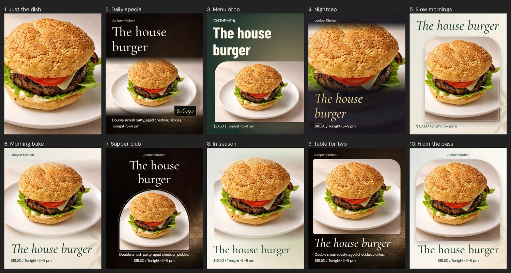
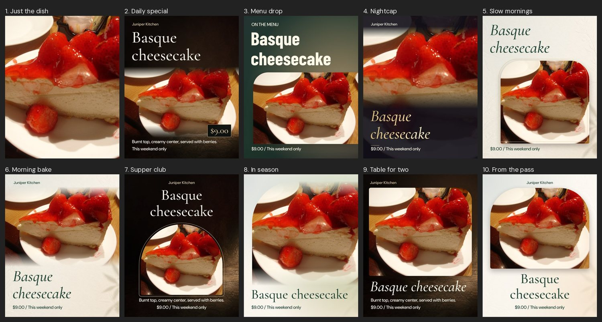
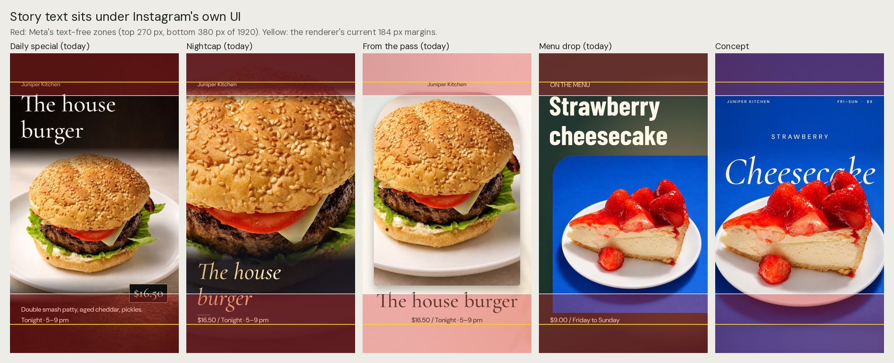
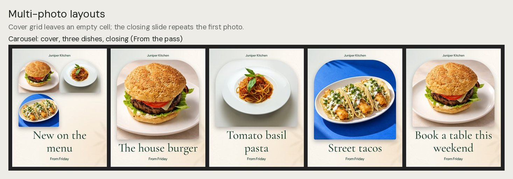
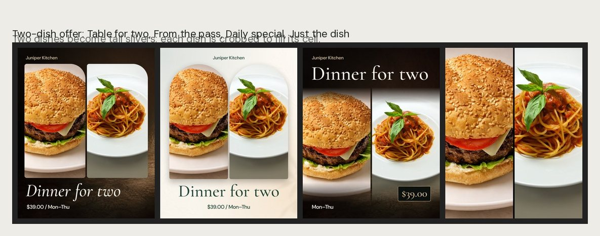
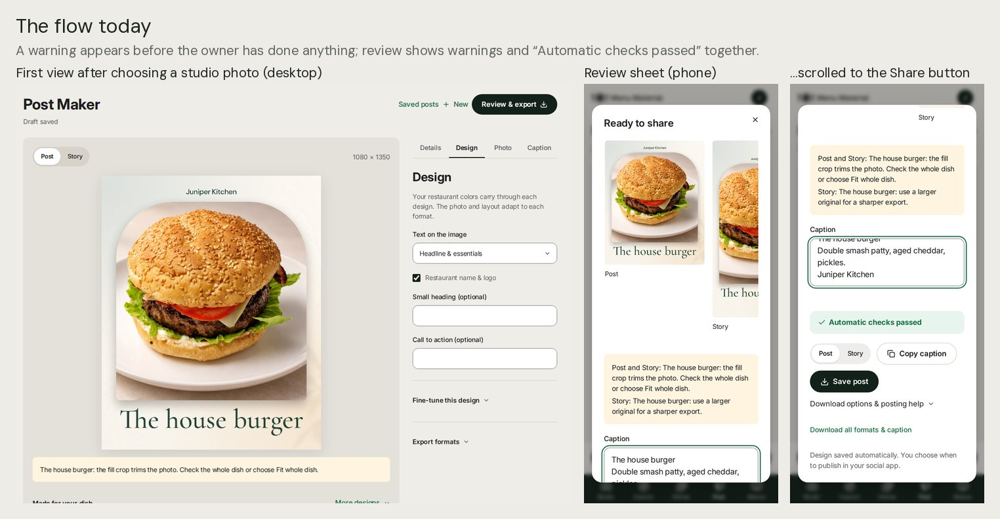
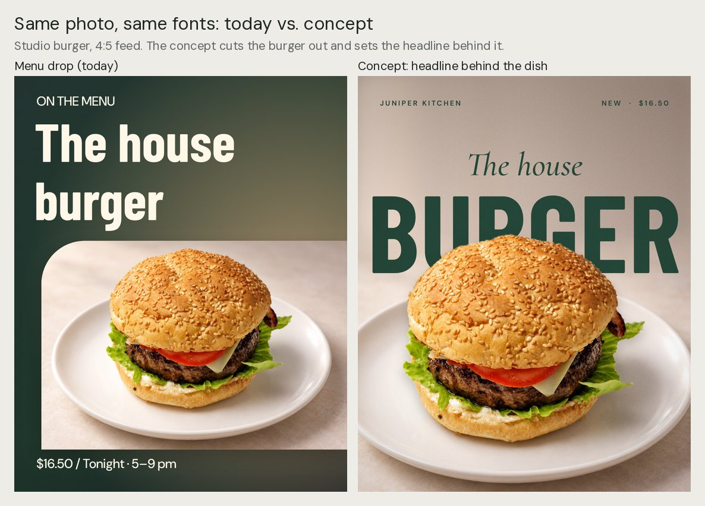
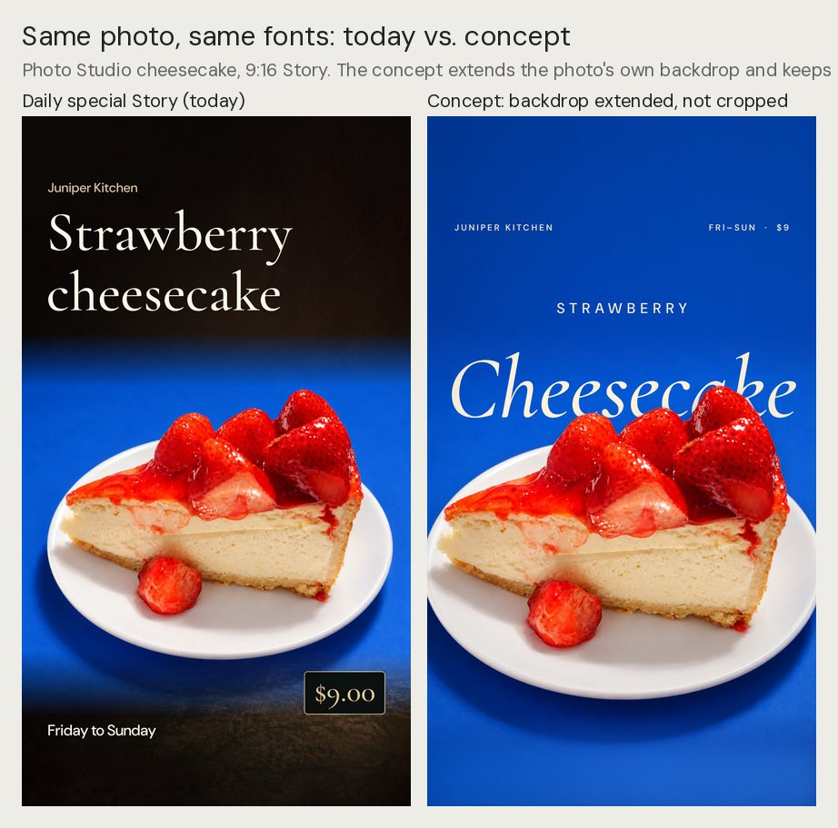
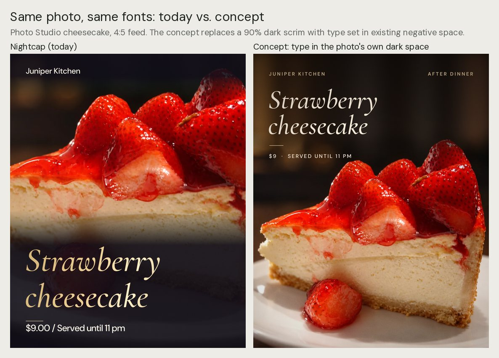

# Post Maker review: usage, value and a plan for premium images

Review date: September 24, 2026. Source: `main` at `200f960`. This builds on the [September 24 site audit](SITE_AUDIT_2026-09-24.md). Its Post Maker notes (3:4 posts, Story safe zones, richer captions, starting from any photo, folding Campaigns in) are included here rather than repeated.

## Bottom line

**Will restaurants use it?** Some will, now and then. Today it's a pleasant way to make a tidy post for a special. It isn't yet something an owner would open every week, because:

- the images aren't clearly better than what they can make in two minutes with Instagram's own tools or a Canva template, and
- nothing brings them back: there's no plan, reminder or scheduling.

**Does it provide value?** Yes, more than it shows. It already knows the restaurant's real dishes, prices and brand. It never invents claims, and it hands finished files to the phone's share sheet. What's missing is output quality: the images look like templates.

**Why the images don't feel premium.** A premium food post depends mostly on the photo and how it's composed for the frame. Type matters less. The renderer does the opposite:

- **It crops photos instead of composing them for the format.** 32 of 40 test renders of ordinary landscape photos warned that the crop trims the photo or that the photo is too small. That includes photos Photo Studio made itself.
- **Story text sits under Instagram's own buttons and bars** in every design that has text.
- **Nine of ten designs use the same serif** for the headline.
- **The photo is boxed or covered.** Dark designs paste light photos into boxes. The nightcap covers about 40% of the photo with a 90% dark overlay, and so does Just the dish once text is turned on.

**The opportunity.** Canva and Instagram mainly decorate a photo the owner already has, and their AI image tools don't know the dish. Menu Material makes the photo and keeps it the same dish. Post Maker can have the photo made *for the post*:

- at the post's shape,
- with room for the words,
- with the dish cut out so the headline can sit behind it.

Neither competitor is built to do that. The three concepts in §5 use the same photos and fonts as today, and they already look like a different product.

**The plan** (details in §6):

1. **Fundamentals (2–3 weeks, no new AI cost):**
   - Story safe zones and a 3:4 format.
   - Extend photos instead of cropping them.
   - A real type system and colors taken from the photo.
   - No dark overlays over the food, and quieter warnings.
   - Faster previews, better multi-photo layouts and working analytics.
2. **Made for this post (4–6 weeks):**
   - Generate or extend the photo for the post's shape.
   - Cut out every approved dish.
   - New design families built on cut-outs.
   - Six ready posts in one tap, with better captions.
3. **Beyond a still image (6–8 weeks):**
   - Short video for Stories and Reels.
   - A weekly plan with posts ready to go.
   - Scheduling and publishing.

## 1. How this was checked

- **Rendered all ten designs** as a Post and a Story with the real renderer (`lib/post-render.ts`), in headless Chromium with the shipped fonts and materials. Test photos:
  - a Photo Studio result (the 1536 × 1024 studio burger from the homepage);
  - an unedited phone photo (the 2592 × 1944 cheesecake original, scaled to 2048 px as an upload would be);
  - Photo Studio versions of that same cheesecake;
  - a three-dish carousel with a cover and a closing slide, and a two-dish offer.
- **Walked the Post Maker page.** Ran the app locally (Node 24, local SQLite), added four dishes with approved photos, and used Post Maker at 1440 × 900 and 390 × 844.
- **Timed rendering** in the same headless Chromium. The container has no GPU.
- **Made three concept images** in a scratch harness with the app's fonts and canvas calls. Their cut-out masks were made offline (OpenCV GrabCut and a color key), standing in for the segmentation step proposed in Phase 2. They show a design direction; they aren't shipped code.
- **Checked current platform rules and competitor features.** Sources are at the end.

Not covered: physical phones, the hand-off into the Instagram app, live AI generation (no API key here) and owner interviews.

## 2. Will restaurants use it? Does it provide value?

**The job is real.** Time is an owner's scarcest resource:

- 56% say they lack the time or resources to promote the restaurant (Popmenu).
- Marketing is one of their three biggest drains on time (Square).

Both figures are cited in the site audit. A tool that turns "a dish we're proud of" into a finished post in a minute is worth paying for.

**What Post Maker already does well. Keep it.**

- **Honest facts.** It uses real dish names, prices and dates. It never invents slogans, discounts or scarcity (`lib/server/creation.ts:176`).
- **Brand.** It carries the restaurant's colors and type across designs.
- **Built-in checks.** It rejects text too long to read comfortably, and it blocks sharing while the restaurant still has a placeholder name or a shown price is missing.
- **Sharing that works on phones.** It prepares full-size files before the Share tap, so the phone's share sheet opens (`app/components/post-sharing.tsx:105-110`).
- **Formats.** One draft gives a Post, a Story and a carousel, each with its own framing, and drafts are saved.
- **A calm editor.** On desktop the path is short: dish → design → Review & export.

**What stops weekly use.** Owners will compare it with tools they already have.

| Tool | What owners get there | Post Maker today |
|---|---|---|
| Instagram and its Edits app | Free and already open: text styles, cut-outs (Edits uses Meta's SAM segmentation), color correction, templates, music, Reels, scheduling | A separate app to open, images not clearly better, no video |
| Canva Pro | Thousands of restaurant templates, Brand Kit, Background Remover, Magic Resize, AI captions, scheduling | 10 designs, one headline typeface, no cut-outs, crops instead of resizing well, one caption, no scheduling |
| Popmenu and posting services | A week of content, generated or written for them | One post at a time, no plan or reminders |

**Menu Material's lane.** Neither Canva nor Instagram is built to start from a mediocre phone photo and deliver a studio-quality image of the same dish, composed for the post, with the right facts and brand. Post Maker doesn't use that lane yet: it takes whatever approved photo exists, crops it and decorates it.

**Verdict.** Keep investing:

- Posts are the most frequent reason an owner would open Menu Material.
- They're the natural place to spend image credits.

Judge the feature by one test: *is the default result clearly better than what the owner would post otherwise, and faster?* Today the answer is "about the same, and slower." Phases 1 and 2 aim for "clearly better, in one tap."

## 3. What the images look like today

*All ten designs as Posts, with a Photo Studio burger (1536 × 1024). They're clean and tidy, but nine share one headline serif, and most put the photo in a box.*

*The same designs with an unedited phone photo. No design rescues it: the clutter, the orange light and the tight crop remain in every version.*

### Findings: the images

1. **Photos are cropped to the frame, not composed for it.**
   - Social photos are generated at 1024 × 1536 (2:3). That includes Photo Studio's "Story" format, which targets 1080 × 1920 (`lib/server/generation.ts:41-49`, `lib/studio.ts:153-159`).
   - To fill a 9:16 Story, a 2:3 social photo or a square menu photo has to be enlarged by 25%. A 16:9 delivery photo needs 67%.
   - The 3:2 studio burger used here needs 88%, and only 38% of its width survives. Full-bleed designs show a soft, zoomed-in slice of the dish.
   - 32 of 40 test renders raised "the fill crop trims the photo", "use a larger original", or both (`lib/post-composition.ts:387-394`).
   - When Photo Studio made the photo, the owner can't act on "use a larger original".
2. **Story text sits under Instagram's own buttons and bars.**
   - Stories keep only 184 px clear at the top and bottom (`lib/post-composition.ts:125-126`).
   - Meta's current guidance, as summarized by ad-spec guides, keeps text and logos out of the top 14% (about 270 px) and the bottom 20% (about 380 px).
   - Every design with text puts some of it there: the restaurant name, kicker or headline under the profile row at the top, or the price, date or headline under the reply bar at the bottom. Most do both.
   - The export tests allow text from 150 px to 1780 px (`tests/exports.mjs`), so they pass anyway.

   

3. **Ten designs, one voice.**
   - Nine of ten headlines use Cormorant Garamond, roman or italic. Only Menu drop uses Barlow Condensed.
   - The handwritten face from the [design direction](SOCIAL_DESIGN_DIRECTION.md) now appears only in legacy drafts.
   - Uppercase kickers have no letter-spacing (`lib/post-composition.ts:531` and the other kicker calls).
   - Headlines break greedily: "New on the / menu", "Book a table this / weekend".
   - The price and date line reads like data: "$16.50 / Tonight · 5–9 pm" (`:177`).
   - The restaurant name is 36 px, about 13 pt on a phone screen.
4. **Photo and background don't belong together.**
   - Four designs paint a copper-velvet texture and four a botanical paper, whatever the photo (`:547-714`).
   - A light studio backdrop on dark velvet reads as a pasted rectangle.
   - The "blend" fade covers only 14% to 17% of the photo's height, so the edge still shows (`:397-408`).
   - On Stories, the 1122 × 1402 texture is stretched to 1080 × 1920, which distorts it (`lib/template-materials.ts:80`).
5. **Dark overlays hide the food.**
   - The nightcap darkens the whole text area to 90% black (`lib/post-composition.ts:500`), about 40% of the photo. Just the dish does the same once text is turned on.
   - The band behind the restaurant name adds a hard dark strip across the top of the dish (`:517-526`).
6. **The renderer ignores what it already measures.**
   - `photoCharacter` works out the photo's quiet edge, top brightness and background color, but only its detail-weighted center is used, for auto-framing on a 32 × 32 thumbnail (`:69-112`, `:378-381`).
   - That center misframes busy phone photos; see the cheesecake set above.
7. **The brand signature is weak.** The logo sits on a white square in every design (`:325`), and the name is small, with no letter-spacing.
8. **Multi-photo layouts break down.**
   - Photos go into a two-column grid, and each cell is rounded like a single photo (`:363-367`).
   - A three-dish cover leaves an empty cell.
   - Two dishes become tall slivers.
   - The closing slide repeats the first dish (`:33`).

   

   

9. **No 3:4 format.** Instagram has shown profile grids at 3:4 since January 2025, and it accepts 1080 × 1440 posts. Exports are 4:5 and 9:16 only (`lib/sharing.ts:69-76`).
10. **No step to improve the photo.** Post Maker lists only approved photos (`app/components/post-maker.tsx:136-139`) and uses them as they are. An unedited phone photo goes straight into the design; nothing offers "make this photo for the post".

### Findings: the page

1. **A warning greets the owner.**
   - The default design is From the pass (`post-maker.tsx:68`). With a Photo Studio photo, it immediately warns "the fill crop trims the photo" (`:508-514`).
   - Review then lists that warning and "use a larger original" right next to "Automatic checks passed" (`:1167-1225`).
2. **Too many decisions for a phone.**
   - There are four tabs, three collapsible sections and about 20 controls: purpose, headline, description, price toggle, price, date, text amount, brand, placement, kicker, call to action, two colors, typography, fit, position, zoom, caption voice and formats.
   - Most posts need four: the dish, a headline, a price or date, and a design.
3. **Few options, chosen by keyword.**
   - "Made for your dish" shows three designs, picked by matching words in the dish name and purpose (`lib/post-composition.ts:48-68`).
   - There's no "more like this" and no variations of a design.
4. **Previews do a lot of work on every keystroke.**
   - Each edit re-renders the preview and every design thumbnail at full 1080 px size, then shrinks the thumbnails. Nothing waits for typing to pause (`app/components/post-canvas.tsx:29-67`, `post-maker.tsx:528-553`).
   - One design took 120–190 ms to render here. That's about 0.5 s of work per keystroke with the three recommendations showing, and about 1.5 s with More designs open.
   - Phones are likely slower; this wasn't measured.
5. **Captions are thin.**
   - The starter caption is the dish name, description and restaurant name (`lib/post-flow.ts:44-64`).
   - AI writes one caption under 60 words, with no opening line, call to action, hashtags or alt text (`lib/server/creation.ts:150-186`).
6. **On phones, Share sits at the bottom of a long review sheet**, below the previews, warnings, caption and checks.

## 4. What "premium" means for a restaurant post

The concepts follow these rules, and the plan builds on them.

1. **The dish is the hero.** Never cover it. Words go where the photo is quiet.
2. **Compose for the format.** Make or extend the photo at 4:5, 3:4 or 9:16, with room where the words go. Don't crop a landscape photo into a Story.
3. **The photo and the design are one image.**
   - Take the background and text colors from the photo.
   - Cut the dish out, so type can sit behind it and shadows fall naturally.
4. **Typographic restraint.**
   - At most two type styles per design.
   - Letter-spaced small capitals for labels.
   - Balanced line breaks, few words and a clear price.
5. **A house finish.** Use the same color grade, grain, type and color on every post, so the grid reads as one restaurant.
6. **Respect the platform.** Keep text inside the Story safe zone and the 3:4 grid crop. Leave music, stickers and link stickers to Instagram.

## 5. Concepts: same photo, same fonts

*Depth. The burger is cut out and the headline is set behind it. The backdrop above the dish is the photo's own, extended.*

*Composed for 9:16. The square Photo Studio image is extended with its own blue backdrop instead of being cropped. The headline sits behind the strawberries, and all text stays inside the safe zone.*

*Type in the photo's own dark space. A gentle gradient behind the text replaces the 90% overlay, and the dish is untouched.*

| Technique | How the concepts do it | Production approach |
|---|---|---|
| Extend the backdrop | Copy the edge rows outward, blur them and fade the join | Works now for plain studio backdrops (Phase 1); generated extension for everything else (Phase 2) |
| Cut-out dish | Mask made offline | A mask saved with each approved photo (Phase 2) |
| Type | Letter-spaced labels, balanced lines, one display face per design | `ctx.letterSpacing`, a balanced line breaker, two or three more OFL faces (Phase 1) |
| House finish | 5–6% film grain and a soft vignette | Part of the restaurant look (Phase 1) |

## 6. The plan

How Post Maker answers the features owners know from Instagram and Canva:

| Feature | Instagram and Edits | Canva | Post Maker today | Plan |
|---|---|---|---|---|
| Better food photo than the owner shot | No | Partly (AI edits) | In Photo Studio, not in posts | Make the photo for the post (Phase 2) |
| Real dishes, prices and dates | No | No | Yes | Keep |
| Brand colors, type and logo | No | Brand Kit | Restaurant look | Keep; fix the logo (Phase 1) |
| One design in every format | No | Magic Resize | Yes, but it crops | Compose for each format; add 3:4 (Phases 1–2) |
| Cut-outs | Yes | Background Remover | No | Masks for every approved photo (Phase 2) |
| Filters and color | Yes | Yes | Photo Studio only | House finish (Phase 1) |
| "Design it for me" | No | Magic Design | Three picks by keyword | Six ready posts (Phase 2) |
| Captions | No | AI captions | One, bare | Three, with a call to action, hashtags and alt text (Phase 2) |
| Motion | Reels, Edits | Animation | No | Short video (Phase 3) |
| Scheduling | Yes | Yes | No | Plan, remind, then publish (Phase 3) |

### Phase 0: measure first (days)

- Send the post ID with export events, so shares are counted. The site audit (§3) found post exports are dropped from the owner report.
- Record which design, format and edits each shared post used.
- Show the three concepts to five pilot owners beside their last three Instagram posts, and ask which they'd post.

### Phase 1: fundamentals (2–3 weeks, no new AI cost)

| # | Change | Where | Done when |
|---|---|---|---|
| 1 | Story safe zone: keep text and logos between 270 px and 1540 px, and 65 px from the sides. New designs keep 4:5 text inside the centered 3:4 grid crop. | `lib/post-composition.ts:125-126`; bounds in `tests/exports.mjs` | Export tests fail on any text outside the zone |
| 2 | Add 3:4 (1080 × 1440) as "Grid post". Keep 4:5 as the default until tested. | `lib/sharing.ts:69-76`, renderer height, format toggle | All three formats render and share |
| 3 | Extend instead of cropping. When a photo's shape doesn't match, extend a plain backdrop (sample the edges, blur, fade the join), or place the whole photo on a background sampled from it. Crop only when the owner chooses to. | `photo()` in `lib/post-composition.ts:354-429` | No crop or enlargement warning for any Photo Studio result |
| 4 | Warn only when it matters: when the dish itself would be cut or would look soft. Never show "Automatic checks passed" beside a warning. | `:387-394`; `post-maker.tsx:508-514, 1167-1225` | A fresh post opens with no warning |
| 5 | Type system: `ctx.letterSpacing` for capitals; balanced line breaks; the price set as its own element; "·" separators; restaurant name at 30 px or more, letter-spaced; two or three more OFL display faces, so designs stop sharing one serif | `measure()` and `text()` at `:199-275`; `lib/post-fonts.ts` | Contact-sheet review; no line holds a single word when two balanced lines fit |
| 6 | Colors from the photo: use `photoCharacter`'s background color and brightness to choose background, text and gradient colors. Stop stretching textures: crop them to cover, or add Story-sized versions. | `:69-112`; `lib/template-materials.ts:80` | Light studio photos never sit on a contrasting slab |
| 7 | No dark overlays over food: place text on the photo's quiet edge or in its dark areas, with a gradient only behind the text | `:455-545` | No overlay darker than 60% covers the dish |
| 8 | Logo without the white square: show transparent logos as they are, and use a one-color version when contrast is low | `:311-353` | The logo reads on both dark and light designs |
| 9 | Multi-photo layouts designed for each count: a hero with two smaller photos, a three-across strip, and later overlapping cut-outs. The closing slide shows the name, address and "Book" or "Order" instead of repeating a photo. | `:16-40`, `:354-429` | Covers for 2–6 dishes have no empty cells |
| 10 | Faster previews: wait 150 ms after typing stops; render thumbnails at 324 px directly; reuse decoded photos | `post-canvas.tsx`; photo loading at `:431-434` | Typing a headline stays smooth on a mid-range phone |
| 11 | Designs as data: describe each design's layout (areas, anchors, type styles, safe zones) as data, so new designs and variations don't need new branches in a 650-line function | `lib/post-composition.ts` | A new design is a data entry plus a contact-sheet review |

### Phase 2: made for this post (4–6 weeks). This is the differentiator.

1. **Make the photo for the post (1 credit).**
   - A "Make this photo for the post" action generates the dish at the post's shape, with clean space where the design puts words (for example, "keep the top third as plain backdrop").
   - Offer it automatically when a photo's shape or quality doesn't fit, and for unedited phone photos.
   - Request the model's largest portrait sizes, and confirm which sizes the configured model supports. Social photos use 1024 × 1536 today, while delivery photos already use 2048 × 1152.
   - Where: `imageSettings` and the Framing line of `imagePrompt` (`lib/server/generation.ts:34-56, 98`).
2. **Extend to a new shape.** "Extend to Story" uses generated extension, with the original photo as the source of truth, for photos whose backdrop can't simply be copied outward.
3. **Cut out every approved photo.**
   - Save a mask of the dish when a photo is approved.
   - Use its outline and bounding box to place text, draw shadows and frame automatically.
   - Choose between the image provider (if it can return transparent backgrounds) and an open segmentation model run by the worker. Check licenses: some popular background-removal models are for non-commercial use only.
4. **New design families built on cut-outs and photo color:**
   - **Depth:** the headline behind the dish.
   - **Cut-out on color:** the dish on a brand or photo color, with a real shadow. This also fixes the "pasted box" look of the dark designs.
   - **Editorial:** type in the photo's quiet space.
   - **Offer:** the price as the hero.
   - **Menu card:** a carousel slide listing dishes and prices.

   Merge look-alikes, such as Slow mornings and The morning bake, or In season and From the pass.
5. **Six ready posts in one tap.**
   - After the owner picks a dish, show six finished options of this post. Allow any photo, and ask for approval at export, as the site audit recommends.
   - Rank options by photo analysis (subject, quiet space, colors), purpose and brand.
   - Add "More like this" and "Shuffle". Everything else moves behind Edit.
6. **Captions worth pasting.**
   - Offer three options: short, story and offer.
   - Each gets an opening line, a call to action that fits the restaurant (order link, reservations or walk-ins), 3–5 local hashtags and alt text.
   - Keep the current rules against invented facts.
7. **The Photo Studio hand-off.** "Make a post & Story" (`app/components/photo-downloads.tsx:352`) opens the six options directly.

### Phase 3: beyond a still image (6–8 weeks)

1. **Motion for Stories and Reels.**
   - A 6–8 second MP4 made from the same design: a slow push-in, the cut-out dish moving against its backdrop, and the type fading in.
   - Encode it in the browser (WebCodecs) or in the worker.
   - Leave music to Instagram.
2. **A weekly plan.**
   - "Three posts ready this week", built from new dishes, specials, events and quiet days.
   - Fold Campaigns' offer types into Post Maker's purposes (site audit §5.1).
3. **Schedule and publish.**
   - Start with reminders.
   - Then publish directly to Instagram and Facebook (Business and Creator accounts), and post to Google Business Profile.
4. **See it in the grid.** Preview the new post beside the restaurant's recent posts at 3:4.
5. **Learn what works.**
   - Record which designs get shared.
   - With a connected account, also record which get saves and reach.
   - Use that to rank the options.

## 7. How we'll know it worked

- **Speed:** the median time from opening Post Maker to Share is under 60 seconds.
- **Default quality:** at least 60% of shared posts use one of the six options with only text edits.
- **Habit:** restaurants share at least one post a week, four weeks after signup.
- **Preference:** in a side-by-side test, 7 of 10 owners prefer the new default to their own last posts.
- **Automated checks:**
  - no text outside the Story safe zone;
  - no crop or enlargement warning on Photo Studio results;
  - a contact-sheet review for every design change.

## 8. Risks

- **Honesty.** Generated or extended backgrounds must never change the food. Keep the original, label AI-edited images and add provenance metadata (site audit §6).
- **Cost.** "Make this photo for the post" costs a generation. Measure the cost per shared post before setting prices (site audit §8).
- **Licenses.** The fonts are SIL OFL. Check segmentation model licenses. Avoid music.
- **Platform access.** Direct publishing needs a Business or Creator account and Meta's app review.
- **Phone performance.** If the 150 ms wait isn't enough, move rendering into a web worker with OffscreenCanvas.

## Sources

Platform rules and competitor features change often. Check them again before quoting.

- Story safe zones (summaries of Meta's current guidance):
  - https://www.firstpier.com/resources/instagram-ad-safe-zones
  - https://frameextractor.video/blog/instagram-safe-zones/
- Instagram's 3:4 grid and 1080 × 1440 posts:
  - https://nealschaffer.com/instagram-post-size/
  - https://www.oktopost.com/blog/instagram-grid-size-guide/
- Canva features for restaurants:
  - https://restaurant.menufy.com/article/canva-guide
  - https://www.canva.com/design-school/resources/whats-new-canva-july26
- Instagram's Edits app (SAM cut-outs, templates, color correction):
  - https://www.inro.social/blog/edits-new-meta-app
  - https://apps.apple.com/us/app/edits-video-editor/id6738967378
- Automated restaurant posting:
  - https://foraithings.com/guides/ai-tools-restaurant-owners/
  - https://www.posthell.com/for/restaurants
- Owner time and marketing statistics: see the [site audit's Appendix C](SITE_AUDIT_2026-09-24.md#appendix-c--sources-for-market-and-platform-claims).
