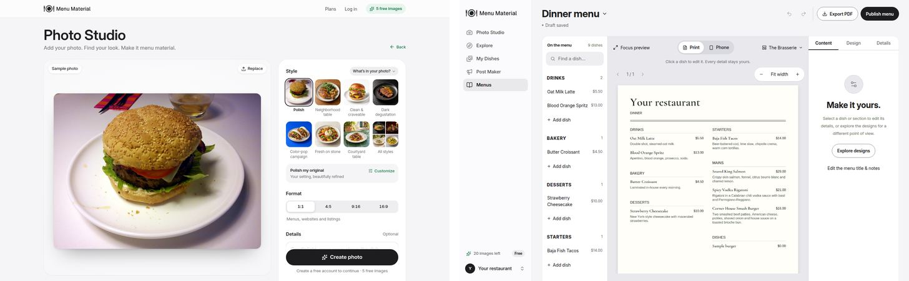
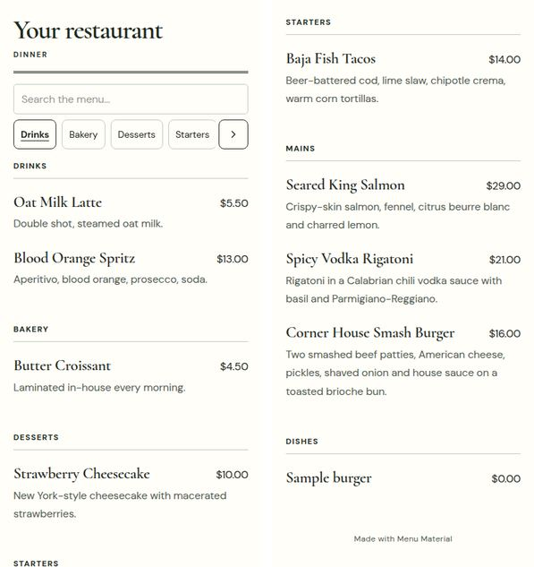
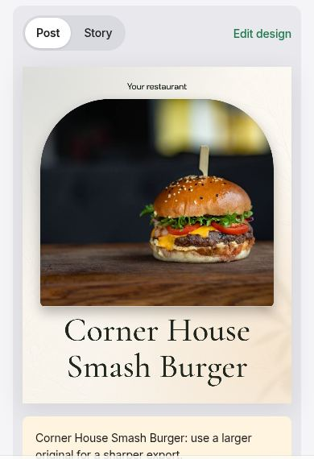
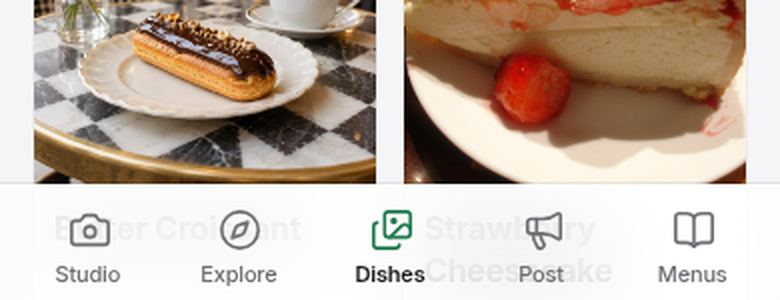
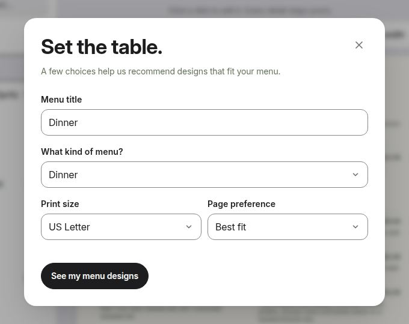
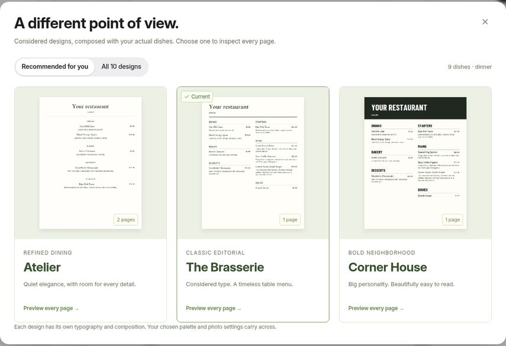

# Menu Material site audit for public launch

Audit date: September 24, 2026. Source: `main` at `f539f4b`, which includes the "one calm visual system" redesign (#3) and the Photo Studio canvas rebuild (#4). Earlier reviews: [public-launch audit, Sept 16](PUBLIC_LAUNCH_AUDIT_2026-09-16.md) and [design review, Sept 17](DESIGN_REVIEW_2026-09-17.md). Their current status is in Appendix A.

## Bottom line

The site now looks and feels close to launch quality. Every screen shares one calm, food-first visual system. Photo Studio, the style library, the menu editor and the publish/QR flow are genuinely good.

The earlier reviews are mostly addressed:

- Most engineering blockers from the September 16 audit are fixed: fair job queue, pause checked at dispatch, budget ledger, draft recovery, saved-work paging, login rate limits and upload quotas.
- 20 of the 30 September 17 design findings are fixed, and the other 10 are partly done.

What still stands between the site and a public launch is mostly **around** the product, not in it:

1. **No account safety net.** New users can't recover their account, verify their email, reach support, read Terms or delete their data.
2. **The AI budget can be drained.** Signup is open with no verification or CAPTCHA, and the default AI budgets are small. A few throwaway accounts can use up the whole day's budget for every restaurant.
3. **The homepage arrives empty.** Crawlers and slow phones get "Getting things ready…" until JavaScript and an API call finish. This regressed on September 22.
4. **Placeholder names go public.** "My restaurant" and a permanent `my-restaurant-xxxxxxxx` menu address show up on published menus, posts and printed QR codes.
5. **There's no way to pay.** A free user who runs out of images hits a dead end.

After those, the biggest improvement is **simplification**. There are five main destinations, plus a hidden "More tools" area and a hidden Campaigns tool, and they overlap. Going to four destinations (Photo Studio, Dishes, Posts, Menus) and removing a few confirmations and pop-ups would make the product noticeably easier to use.

For new features, the evidence points away from better photo editing, which DoorDash, Uber Eats and Square now give away free. It points toward **the owner's real food, kept consistent and current everywhere guests decide**:

- photo packs checked against each delivery app's rules
- Google Business Profile sync
- one edit that updates prices and availability on every menu
- allergen and dietary information
- a weekly posting plan

## How this was checked

- **Hands-on walkthrough** of a local build of the same commit in Chromium at 1440×900 (desktop) and 390×844 (phone). The hosted site was blocked by the audit environment's network policy.
  - Went from the homepage through guest Photo Studio, signup and into the workspace.
  - Added 8 dishes with photos, built a menu from them and published it.
  - Used the share/QR step and opened the public guest menu on a phone.
  - Made an Instagram post.
  - Opened settings, More tools and Administration.
- **Automated checks:**
  - axe-core accessibility scans of the public pages and the guest menu
  - `typecheck`, `lint`, every test suite and a production build
  - homepage download size, measured on a production preview
- **Source review** of platform readiness (auth, abuse, costs, operations, SEO), product structure and copy, with file:line evidence.
- **Market scan** of comparable tools, owner surveys and platform photo rules. Sources are in Appendix C.

Not covered:

- live AI output quality (the audit environment had no API key)
- physical iPhone and Android devices
- screen readers
- production hosting configuration
- legal review

## 1. What's working — keep it

- **One visual system.** Inter, confident headings, neutral surfaces, one green accent and generous spacing. The marketing site and the workspace now feel like one product.
- **A strong first run.**
  - "Try it free" opens Photo Studio without an account, and "No photo handy? Try a sample" is one tap away.
  - The photo stays on the device until signup.
  - Signup is two fields, and the draft carries through.
- **Photo Studio's canvas-and-panel layout,** the searchable style library (collections, occasions, favorites) and "Make it yours" customization with no prompt writing.
- **The menu editor.**
  - Outline, live proof with Print/Phone preview, and inspector.
  - A publish review, then a stable link, QR code, 4×6 table card and a "Guest access checked" confirmation.
- **The guest menu on a phone.** It is legible, has search and category chips, and keeps "Made with Menu Material" small.
- **Engineering foundations.**
  - Security: tenant isolation, hashed sessions and tokens, cross-site request checks, per-IP login limits.
  - Jobs and spending: atomic budget ledger, fair queue with deadlines, idempotent jobs.
  - Uploads: streaming size caps.
  - All 18 test suites pass, plus the menu and template suites. Typecheck and the production build pass.
  - There are no third-party trackers.
  - axe found no violations on the homepage, pricing, privacy, guidelines or guest-menu pages.

## 2. Launch blockers

Fix these before opening signup to the public. Effort is relative: **S** = a focused change, **M** = a coordinated feature, **L** = substantial work.

### B1. No account recovery, email verification or support channel (M)

**Problem**
- The sign-in dialog says: "Automated password-reset emails are not available yet. If you have an administrator contact, request a secure reset link."
- The privacy page says: "A public support email address is not available yet."
- There is no email-verified flag. Anyone can register someone else's address, and the real owner is then locked out.

**Evidence:** `app/components/auth.tsx:262-267`, `app/privacy/page.tsx:116-117`, `db/schema.ts:10-16`.

**Fix**
- Add a transactional email provider.
- Verify the email address before the first generation.
- Add self-serve password reset.
- Publish a support address in the footer, sign-in dialog and privacy page.

### B2. No Terms, consent or account deletion; privacy page partly inaccurate (M)

**Problem**
- `/terms` returns 404 and nothing links to it. Signup asks for no consent.
- Deletion is "handled by an administrator".
- The privacy page names no operator.
- It says guest photos stay in "the current browser tab", but they're kept in browser storage for 24 hours.

**Evidence:** `app/components/site-chrome.tsx:27-31`, `app/privacy/page.tsx:29,101`, `lib/guest-studio-storage.ts:5`.

**Fix**
- Have the Terms and privacy policy reviewed. Cover the operator, contact details, retention, AI processing and commercial use of outputs.
- Add a consent line at signup.
- Build "Delete my account", removing the database rows and both private and public stored files.

### B3. Open signup can drain the AI budget for every restaurant (M)

**Problem**
- The defaults are a $100/day site-wide budget and a $2 reservation per image. That's about 50 images a day across all restaurants.
- Reservations are never corrected to the real cost.
- Signup is rate-limited only per IP-and-email pair, so one IP can create any number of accounts. There's no CAPTCHA or email verification.
- Photo analysis, captions, menu import and menu wording also spend AI budget without counting against the 5 free images.
- Once the budget is used up, every restaurant's jobs are re-queued every minute until it resets at midnight UTC.

**Evidence:** `lib/server/safeguards.ts:26,51-54`, `lib/server/api.ts:148`, `lib/server/generation.ts:930-943`.

**Fix**
- Base reservations on measured cost, and reconcile them with actual usage.
- Add a CAPTCHA (e.g. Turnstile) and require a verified email before the first generation.
- Keep separate budgets for free and paid accounts.
- Cap non-image AI calls for free accounts.
- Alert when the budget reaches 50% and 80%.

### B4. The homepage isn't server-rendered (M)

**Problem**
- The HTML sent to browsers and crawlers contains only "Menu Material · Getting things ready…". The landing page appears only after the JavaScript bundle loads and an `/api/state` round trip finishes.
- That delays the largest paint, and crawlers that don't run JavaScript see no content.
- The meta tags are still in the HTML, so link previews still work.
- This regressed in `bbca37c` on September 22.

**Evidence:** `app/page.tsx:135-144` renders the placeholder until `loaded` is true. Confirmed with `curl`.

**Fix:** Render the landing page on the server, since it's static. Load the signed-in state afterwards, or branch on the session cookie on the server.

### B5. Placeholder identity leaks into public output (S–M)

**Problem**
- Restaurant name is an optional, collapsed field at signup and defaults to "My restaurant".
- That name headlines the published menu, appears on post artwork and in captions.
- The menu address (slug) is derived from it once and can never be changed, so printed QR codes lock it in.
- The publish review did not flag it.

**Evidence:** `app/components/auth.tsx:197-217`, `lib/server/api.ts:205,230`. Seen on the published menu and the post below.

**Fix**
- Require the restaurant name at signup, or before the first publish or export.
- Confirm the menu address at first publish.
- Allow renaming, with a redirect from the old slug.

### B6. No way to pay; free users hit a dead end (M)

**Problem**
- Pro is "coming soon" and Stripe is off.
- At 0 images, users are sent to Plans, where Pro says "Subscriptions open soon." There's no way to join a waitlist.
- The default per-restaurant budget ($20/day at $2 per image, about 10 images a day) would also cap a Pro user unless an admin raises it.

**Evidence:** `app/components/plan-cards.tsx:92`, `STRIPE_BILLING_ENABLED=false` in `.env.example`, `daily_budget_cents` defaults to 2000 in `db/schema.ts`.

**Fix**
- Turn on Stripe, with tax settings and Terms consent. At minimum, collect Pro waitlist emails.
- Make daily budgets depend on the plan.

### B7. Operations aren't ready for unattended use (M)

**Problem**
- The waiting screen promises "You can leave this page. We'll keep working." That's only true when the background worker is running. Locally, Administration reports "Background runner is not configured".
- `/api/health` returns `{ok:true}` without checking the database, storage or worker.
- Server errors go only to `console.error`.
- There are no error or not-found pages. Unknown URLs get the framework's plain 404, and a client crash blanks the workspace.

**Evidence:** `app/components/studio-onboarding.tsx:169-172`, `lib/server/api.ts:557`. None of `app/error.tsx`, `app/global-error.tsx` or `app/not-found.tsx` exists.

**Fix**
- Run the worker in production with a heartbeat alert.
- Add a readiness check and error reporting.
- Add a branded 404 page and error boundaries with a Reload action.
- Test restoring the database and storage together.

<table><tr>
<td width="50%"></td>
<td width="30%"></td>
</tr></table>

*Left: the published guest menu is headed with the placeholder name and lists "Sample burger · $0.00" (see §5.7). Right: the placeholder name on a post.*

## 3. Also before launch (high priority)

- **Moderation of public pages (M).**
  - Any new account can publish a menu page with its own text, photos and any "Order" link it likes, at `/m/<slug>` under "Made with Menu Material".
  - Admins can pause a restaurant's AI use, but can't unpublish or suspend its public page. The public route checks only that the menu is published (`lib/server/api.ts:579-584`).
  - Add admin takedown, and a small "Report this page" link.
- **SEO basics (S–M).**
  - `/robots.txt` and `/sitemap.xml` return 404.
  - There's no canonical URL or `metadataBase`.
  - `/pricing` and `/privacy` reuse the homepage's social title.
  - Missing menus return HTTP 200 (a "soft 404"), and their metadata reads "View the current menu from Menu unavailable" (`app/m/[slug]/page.tsx`).
  - Published menus have no share image and no structured data.
- **Image weight (S).**
  - The homepage downloads about 7.7 MB on desktop and about 10 MB on a 3× phone, roughly 95% of it images.
  - The two hero images alone are 2.5 MB, because the "optimized" WebPs are effectively lossless. Re-encoding them at quality 80 brought them to 232 KB (−91%) in a test.
  - The style gallery downloads all five 960px images (about 4 MB), although only one is visible at a time.
- **Accurate owner analytics (S–M).**
  - The Downloads tile still counts old event names.
  - Post exports send no entity ID, so they're dropped from the query.
  - The client silently ignores rejected events. One `POST /api/creation-events` returned 400 during first sign-in in this audit.
- **Security headers (S).** The app sets no CSP, HSTS, frame-ancestors or Referrer-Policy. Confirm what the host adds, and set the missing ones in the worker.
- **Stale docs (S).** The README still says the product is "invitation-only, capped at 10 restaurant workspaces".

## 4. Design: making it feel sleek

The look is already clean. What will make it feel sleek now is **consistency and restraint in the details**, not a new visual direction.

1. **Make every control the same control.**
   - The CSS has 210 distinct hex colors, 122 font sizes (only 18% use the type tokens), 40 border radii, 73 box shadows and 152 `!important`s.
   - There are still four button families (`cx-btn`, `md-button`, `st-pill`, shadcn `Button`), seven segmented-control styles and three dialog systems (Radix Dialog, Radix Sheet, and a native `<dialog>` in Menus).
   - Collapse these to one Button, one Segmented control and one Dialog/Sheet, with tokens for type, radius and shadow.
   - Split CSS by route while you're at it: every page loads one 342 KB stylesheet, and the homepage uses 16% of it.
2. **Quiet, plain dialog titles.**
   - Menus uses slogans as dialog titles: "Set the table.", "A different point of view.", "Bring your menu into focus.", "Every detail, checked.", "Ready for your guests.", "A place at every table."
   - Title each dialog with its task instead: "Menu setup", "Choose a design", "Add dishes", "Publish", "Share your menu". Keep the personality in the subtitle.
3. **One status vocabulary.**
   - Photo status is described with eight different words: Approved, Ready to use, Ready for a quick check, Needs review, To review, Review needed, Ready for review, Checked. Use two: "Needs review" and "Approved".
   - Credits have five names: "images left", "image generations", "generations remaining", "image allowance", "image unit". Pick one.
4. **Phone tab bar.** The 72%-white "glass" bar lets dish names show through and overlap its labels on My Dishes and Menus (`app/workspace-shell.css:321`, `--glass` in `app/globals.css:80`). Raise it to about 92–95% opacity, or make it solid with a hairline border.

   

5. **Homepage details.**
   - At 1440×900 the before/after comparison, your best proof, starts at the fold. Trim the hero spacing so more of it is visible. On phones, the main "Try it free" button sits just below the fold.
   - The style gallery labels change with screen size: desktop shows "New backdrop, From above, Served by hand, Close-up"; phone shows "Color, Angle, In hand, Detail". Use one set.
   - The showcase is one burger and one cheesecake from Creative Commons photos. Replace it with 3–4 real restaurant results (with permission) across cuisines, including a drink. "Your food stays your food" needs real proof.
   - Add a short "How it works" strip (photo → style → use everywhere).
   - Add a five-question FAQ:
     - Is it still my dish?
     - Can I use it on DoorDash or Uber Eats?
     - Who owns the images?
     - What counts as an image?
     - How do I cancel?
   - Only the homepage header has "Log in"; `/pricing`, `/privacy` and `/guidelines` don't. The footer needs Terms and Contact.
6. **Small polish seen in the walkthrough.**
   - "Draft saved" shows on empty screens before anything exists (Photo Studio, Menus).
   - The format choices read "1:1 · 4:5 · 9:16 · 16:9". Label them "Square · Portrait · Story · Wide", with the ratio as secondary text.
   - The logo field in Settings is an unstyled native file input ("Choose File · No file chosen").
   - In the share dialog, "Download 4 × 6 table card" and "Save QR image" run together with no space.
   - Warnings in the post review start with internal labels ("feed:", "story:").
   - The Menus empty state promises "Seven considered designs"; there are 10. Explore's title is "All Styles", but everywhere else says "All styles".
   - The missing-menu page has no branding, and its body text fails contrast (3.27:1, per axe).
   - An invalid staff-upload link offers "Try opening again", which can't help. Say "Ask the restaurant for a new link" instead.
   - In the signed-out Photo Studio on desktop, the sticky "Create photo" bar sits over the Details field with no background behind it.

## 5. Simplify: fewer concepts, fewer steps

**Proposed structure:** Photo Studio · Dishes · Posts · Menus, plus an account menu (Restaurant settings, Plan, Sign out, and Administration for admins).

1. **Four destinations instead of five plus two hidden ones.**
   - **Explore** shows the same 56 styles as Photo Studio's "All styles" library. Fold it into the library, or turn it into a public inspiration page for visitors.
   - **Campaigns and Post Maker do the same job.** Campaigns is reached from a link in More tools. Both make posts, Stories and captions for specials and offers, each with its own templates, and Campaigns even has its own photo editing.
     - Move Campaigns' offer types (lunch combo, happy hour, catering and so on) into Post Maker's "Purpose" choices.
     - Point the weekly suggestions at Post Maker.
     - This retires about 1,450 lines of older UI.
   - **More tools can go.**
     - Menu import → Menus only. Today there are two importers. The older one writes to a legacy draft that Menus stops reading once Menus has been opened, so its "Publish from Menus" message can point at nothing.
     - Batches → Photo Studio's "Apply to more dishes".
     - Staff upload links → the "Add dishes" menu in Dishes.
     - Activity → Administration. It shows research metrics such as "First-result acceptance" and "Return weeks", which don't help an owner.
2. **Two "look" concepts, not fifteen.**
   - Owners meet Style, Styles, All styles, look, Your look, restaurant look, complete restaurant looks, photo style, restaurant style, saved looks, Polish, Inspiration, Make it yours, Follow this look, designs and graphic template.
   - There are also two competing "default look" settings: Settings' "Start new creations with this look", and a saved look's "Make my default for new photos".
   - Keep just two: **Style** (the scene for one photo) and **Brand** (the restaurant's colors, type and default style, set in Settings).
3. **Ask for the format once.**
   - Photo Studio asks for a format. The download dialog then asks again ("Save for", with 8 options) and may open on the last size used rather than the one just made.
   - Choose the destination once, and label it by use: Menu & website, Delivery apps, Instagram post, Story.
   - Approve a photo once, not once per size or crop.
4. **Make the finished photo the hub.**
   - "Use photo" opens a download dialog in Photo Studio but a list of destinations in My Dishes.
   - "Make a post" and "Add to menu" are hidden under "More photo actions".
   - Show Download · Make a post · Add to menu directly.
   - Add "Try again" to the failure screen, which today offers only "Back to my styles".
5. **Fewer interruptions in Menus.**
   - After you add dishes, "Set the table." pops up asking for a title, menu type, paper size and page preference, all of which are already filled in. Stop opening it automatically.
   - Cut the up-to-three "I checked…" confirmations to one, at publish.
   - Order sections sensibly by default. In this audit, "Use my dishes" produced Drinks → Bakery → Desserts → Starters → Mains.

   

6. **Let Post Maker start from any dish photo.** It lists only approved photos. Approval happens only by downloading in Photo Studio or ticking a box in My Dishes, so a new owner lands on "Your approved dishes will appear here." Ask for approval at export instead.
7. **Keep samples out of real data.**
   - Tapping "Try a sample" inside the workspace creates an ordinary dish named "Sample burger" at $0.00 (`lib/studio.ts:211`, `app/components/photo-studio.tsx:510-535`).
   - In this audit, "Select all" picked it up and it was published on the live menu.
   - Mark sample dishes, keep them off menus, and remove them when the sample is replaced.
8. **Automatic publish checks instead of checkboxes.**
   - The publish review asks the owner to tick "I checked the dishes, prices, photos, and guest notes". It didn't flag a $0.00 price or the placeholder restaurant name.
   - Check automatically for zero or missing prices, placeholder names, duplicate dishes and missing descriptions.
9. **Lighter signup.** A 12-character minimum password is hard to type on a phone. Consider email magic links or passkeys, plus Google sign-in. Make restaurant name the one extra field.

## 6. Improve existing features

**Photo Studio**
- **Warn about each destination's rules before export.** Delivery apps reject predictable things:
  - DoorDash wants landscape photos of at least 1400×800 with no text, borders or overlays, and rejects "creative/overly colorful" backgrounds.
  - Uber Eats wants 5:4–6:4 with no text or logos.
  - Grubhub wants square, food-only images.
  - Google says photos "should represent reality".
  - A style like "Color-pop campaign" (cobalt backdrop) works on Instagram but would likely be rejected by DoorDash. Say so at export.
- **Offer a clearly labeled "faithful" enhancement** (light, color, cleanup; same plate and setting) as the default for delivery apps and Google. Keep bold scene changes for social.
- **Record provenance.**
  - Keep the original, as the app already does.
  - Embed standard "AI-edited" metadata (C2PA/IPTC), and offer an optional "Enhanced from a real photo" note.
  - The EU AI Act's duty to mark generative-AI output applies from August 2026, with a grace period to December 2026 for systems already on the market. Standard edits that don't substantially change the input may be exempt. Have counsel confirm how this applies.
- **"No photo? Describe your dish"** (generating a dish from text): label its results clearly as illustrations and keep them out of delivery exports. With recent press on "AI food slop" on menus, being honest here is a selling point.

**My Dishes**
- **Make dishes the single source of truth.** Menus copy dish details ("Dish details are copied into this menu…"), so a price change in My Dishes never reaches the menus. Keep per-menu overrides, but offer "Update everywhere".
- **Add a one-tap "Sold out today"** that updates the live menu without publishing unrelated draft edits. Published menus are snapshots today.
- **Section is a free-text field.** Offer the existing sections as choices, and show the currency in the price field.
- **Move dietary and allergen info** from free text on menu items to structured fields on each dish (see §7).

**Menus and the guest menu**
- **Bring photos along.**
  - This audit built a menu with "Use my dishes" from nine dishes that all had approved photos. The result had no photos in any recommended design.
  - The bulk path leaves photos behind; only sending a single photo to a menu attaches it (`app/components/menu-studio.tsx:264-296`).
  - When dishes have approved photos, include them and recommend a design that shows them. Photos are what set Menu Material apart.

  

- **Show the restaurant's basics.** Hours are collected in Settings but used only by Campaigns. The guest menu shows no hours, address, phone number or map link. Add "Open now · until 10 pm", tap-to-call, directions, and order/reserve buttons.
- **Give each published menu a share image and structured data,** and return a real 404 for missing menus.

**Post Maker**
- The editorial templates look good. Add Instagram's native 3:4 format (1080×1440) alongside 4:5, and respect Story safe zones.
- Generate two or three caption options with a call to action ("Order from the link in bio") and local hashtags. Today's fallback caption is just the name, description and restaurant name.

**Sharing and analytics**
- Give each placement its own QR code and link (table card, window, flyer, Instagram bio), so owners can see which one brings menu views and ordering clicks.
- Replace the Activity tab's research metrics with a weekly owner summary: menu views, QR scans, top dishes and ordering clicks.

**Performance and engineering**
- **Images and fonts.**
  - Re-encode the hero and gallery images as lossy WebP or AVIF.
  - Load only the visible gallery image.
  - Use the existing 144 KB WOFF2 instead of the 716 KB `CormorantGaramond-Italic.ttf`.
  - Remove about 11.9 MB of unreferenced files from `public/`.
- **Job polling.** While a job runs, the app reloads the full `/api/state` every 2 seconds, and that response includes every dish, asset and caption. Replace it with a small job-status endpoint.
- **Lint.** Fix the 70 lint errors, starting with the React hook rules: setState inside effects, refs read during render, and JSX inside try/catch in `app/m/[slug]/page.tsx`. Then make lint block CI.

## 7. New features worth adding

**Market context.** Photo enhancement alone is becoming a commodity:
- DoorDash offers AI photo enhancement, AI item descriptions and free photoshoots, and those photos can't be reused on other apps.
- Uber Eats uses AI to fix low-quality photos and offers free shoots to new restaurants.
- Square's Photo Studio app is free.

Owners' real shortage is time:
- 56% say they lack the time or resources to promote their restaurant (Popmenu).
- Marketing is one of the three biggest drains on owners' time (Square).
- 71% of operators plan to raise prices in 2026 (Popmenu).

Menu Material's defensible position is **the owner's real food, owned by them, kept consistent and current everywhere guests decide** — delivery apps, Google, Instagram and the table — with very little of the owner's time.

| Priority | Feature | Why it's valuable | Effort |
|---|---|---|---|
| 1 | **Delivery- and channel-ready photo packs.** One tap exports photos sized and checked against the rules for DoorDash, Uber Eats, Grubhub, Google, Instagram (4:5, 3:4, 9:16) and the website. | Rejections are predictable and rule-based, and preparing each size costs owners real time. DoorDash reports 44% higher monthly sales for menus with item photos. | M |
| 2 | **Restaurant info on the guest menu:** hours / open now, address, call, directions, order and reserve. | Uses data already collected, and turns the QR menu into the restaurant's mobile homepage. | S |
| 3 | **Update once, everywhere.** Dish-level prices and availability flow to every published menu, QR code and PDF, with "Sold out today" and bulk price changes (e.g. +5%). | Prices change often right now, and this keeps printed and digital menus accurate. | M |
| 4 | **Allergen and dietary tags.** Structured per-dish fields (the US 9 or EU/UK 14 allergens), icons and a filter on the guest menu, and a printable allergen chart. | Guests expect it, and rules are tightening: the 2022 FDA Food Code, California SB 68 (chains, from July 2026), UK FSA guidance and the EU's 14 allergens. Owners enter it; never infer it from photos. | M |
| 5 | **Google Business Profile sync:** push menu items, dish photos and "Today's special" posts. | Most diners find restaurants through search (85% in Popmenu's 2026 survey), and the Business Profile API supports food menus with dish photos. | M–L |
| 6 | **Weekly plan and scheduling.** Turn the weekly assistant into "3 posts ready this week" with a calendar. Add direct Instagram and Facebook publishing later. | Addresses the owners' top time drain. Canva, Popmenu and Toast already offer scheduling. | M, then L |
| 7 | **Short vertical video from approved photos** for Reels, TikTok and Stories. | 87% of diners have picked a delivery item because of a photo or video (SevenRooms/DoorDash). | M–L |
| 8 | **Campaign attribution and a weekly owner digest.** | Shows owners what's working (views, scans, ordering clicks per campaign), which gives them a reason to return every week. | M |
| 9 | **Owner-reviewed menu translation.** | Useful in tourist areas. | M |
| 10 | **Teams and multiple locations:** roles, approvals and a shared brand. | A natural higher-priced tier. | L |

## 8. Pricing and packaging

- **Cost per image is unmeasured.** Pro at $9.99 for 100 images brings in $0.10 per image. The app's own safety reservation is $2 per image, and the real cost per *approved* image (including retries, photo analysis and captions) hasn't been measured with the current model. Measure it before opening Pro.
- **Comparable prices** (some are third-party figures; check them before quoting):
  - FoodShot AI: $15 for 25 images, $45 for 100
  - FoodPhoto.ai: $9.99 for about 70 credits
  - Photoroom Pro: about $7.50–14.99/mo
  - Canva Pro: about $15/mo
  - MustHaveMenus: $49/mo
  - Popmenu: $179–499/mo
  - Owner.com: $249+/mo
- **Test a higher price once the bundle is real.** Menu Material bundles photos, menus, QR codes and posts. If the menu, Google and "update everywhere" features ship, test a higher price — for example $19–29/mo with monthly credits plus top-up packs — rather than competing on price with single-purpose photo apps. Treat this as a hypothesis to test with owners.

## 9. Suggested order

1. **Launch gate**
   - B1–B7
   - Moderation and SEO basics
   - Image re-encoding
   - Restaurant name and menu address
   - Copy fixes: one name for credits, the status words, the "leave this page" promise, the README
2. **First month after launch (activation)**
   - Four destinations, with Campaigns folded into Post Maker
   - The finished photo as the hub
   - Fewer confirmations and pop-ups
   - Samples kept out of real data
   - Automatic publish checks
   - Photos carried onto menus
   - Restaurant info on the guest menu
   - Channel-ready exports
3. **Next quarter (retention)**
   - Update-once prices and availability
   - Allergens
   - Google Business Profile sync
   - The weekly plan
   - Attribution and the owner digest
   - Design-token consolidation
4. **Later (expansion)**
   - Video
   - Translation
   - Direct social publishing
   - Teams and multiple locations
   - POS and delivery-app integrations

## Appendix A — status of earlier reviews

**September 16 launch audit**

| Status | Items |
|---|---|
| Fixed | Open signup (no invite or cap); mobile Log in; queue fairness and deadlines; pause checked at dispatch; atomic budget ledger; draft loading and conflict recovery; photo-analysis retry; saved-work paging and search; login rate limiting; upload size and storage quotas; dark-menu price contrast |
| Partial | Unattended processing (depends on the worker); analytics event naming; homepage weight; trust and support pages |
| Open | Account recovery; health checks and alerting; soft 404; robots/sitemap/canonical; real-dish fidelity benchmark |

**September 17 design review** (checked in code): 20 of 30 findings are fixed. The other 10 are partly done:

- #4 icon targets
- #7 button family
- #8 heading system
- #9 palette
- #10 spacing
- #16 tabs
- #19 post legibility
- #20 status states
- #29 account recovery
- #30 loading states

## Appendix B — measurements

| Check | Result |
|---|---|
| `npm run typecheck` | Pass |
| `npm test` (18 suites), `npm run test:menus` (5), `npm run test:templates` (2) | All pass |
| `npm run build` | Pass. The chunks over 500 kB are editor, PDF and HEIC libraries that load only when needed |
| `npm run lint` | 70 errors, 92 warnings, all in first-party code |
| Homepage HTML from the server | Only "Menu Material · Getting things ready…" |
| Homepage download size | About 7.7 MB on desktop (1×) and 10.3 MB on a phone (3×); about 95% images |
| Hero images | 2.50 MB now; 232 KB after a test re-encode as lossy WebP |
| Style gallery | All five 960px images (about 4.1 MB) download; one is visible |
| CSS | One 342 KB file (60 KB gzipped) on every page; the homepage uses 16% of it |
| axe-core | 0 violations on the homepage, pricing, privacy, guidelines and guest menu. 1 contrast issue on the missing-menu page |
| HTTP status | `/robots.txt` 404, `/sitemap.xml` 404, `/terms` 404, `/m/does-not-exist` 200 |

## Appendix C — sources for market and platform claims

These pages were read through search-engine extracts, because the audit environment couldn't fetch them directly. Prices and rules change often, so re-check before quoting.

- DoorDash AI menu tools: https://about.doordash.com/en-us/news/doordash-unveils-ai-powered-tools-to-enhance-online-menus-and-streamline-merchant-operations
- DoorDash free photoshoot: https://help.doordash.com/en-us/merchants/article/free-photoshoot
- DoorDash photo rejection reasons: https://merchants.doordash.com/en-us/learning-center/photo-rejection
- Uber Eats merchant photo guidelines: https://help.uber.com/en/merchants-and-restaurants/article/merchant-submitted-menu-catalog-photo-guidelines?nodeId=6985355b-0426-4523-94f2-89bb9b0566e9
- Uber Eats AI photo improvements: https://mobilesyrup.com/2025/07/31/uber-eats-ai-menus-food-images-reviews/
- Grubhub menu imagery specification: https://developer.grubhub.com/docs/3zSHFME4nnntcOeqwbOTYl/menu-imagery-specifications
- Google Business Profile photo guidelines: https://support.google.com/business/answer/6103862
- Google Business Profile food menus API: https://developers.google.com/my-business/content/update-food-menus
- Square Photo Studio: https://squareup.com/us/en/photo-studio/app
- Square restaurant research: https://squareup.com/us/en/the-bottom-line/series/foc/future-of-restaurants
- Popmenu 2026 trends: https://www.prnewswire.com/news-releases/popmenu-releases-top-restaurant-trends-to-watch-in-2026-302692236.html
- Popmenu 2024 trends report: https://get.popmenu.com/toolkit/2024-trends-report
- SevenRooms restaurant trends: https://sevenrooms.com/research/restaurant-trends/
- Instagram 3:4 posts: https://9to5mac.com/2025/05/29/instagram-changes-standard-photo-aspect-ratio/
- 2022 FDA Food Code changes: https://www.fda.gov/food/fda-food-code/summary-changes-2022-fda-food-code
- California SB 68: https://sd20.senate.ca.gov/news/california-first-nation-require-allergen-disclosures-restaurant-menus-sb-68
- UK FSA allergen best practice: https://www.food.gov.uk/business-guidance/allergen-information-for-non-prepacked-foods-best-practice-summary
- EU AI Act Article 50: https://artificialintelligenceact.eu/article/50/
- Press on AI food images on menus: https://fortune.com/2026/09/06/ai-food-slop-restaurant-ads-menus/
- Pricing:
  - https://foodshot.ai/pricing
  - https://foodphoto.ai/pricing
  - https://www.eesel.ai/blog/photoroom-pricing
  - https://socialrails.com/blog/canva-pricing
  - https://www.musthavemenus.com/menu/pricing.do
  - https://get.popmenu.com/pricing
  - https://www.owner.com/pricing
