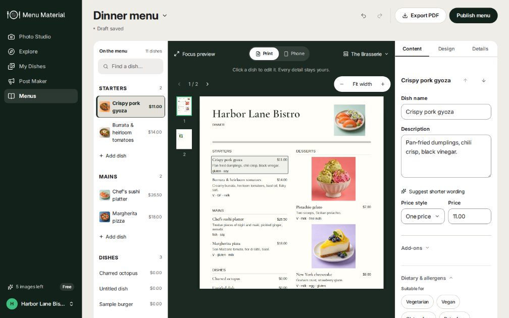
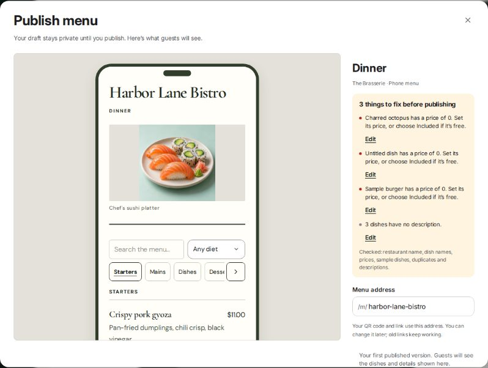
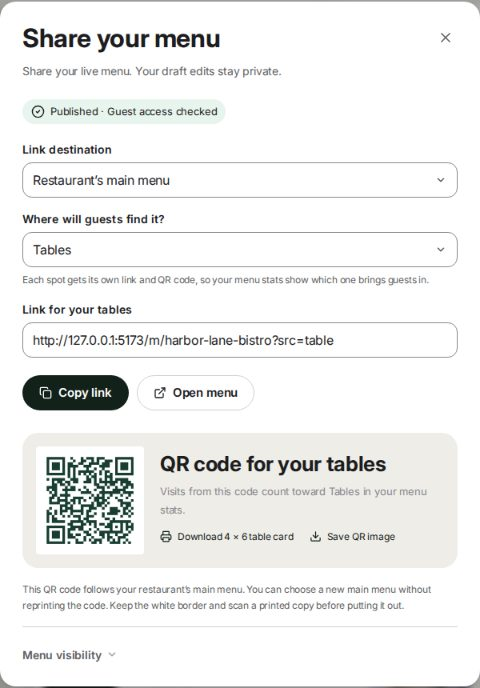
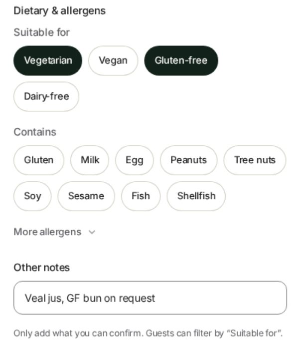
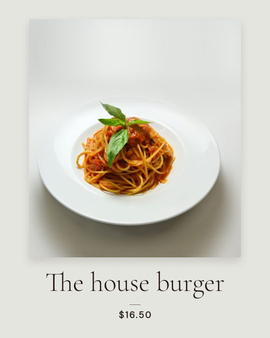
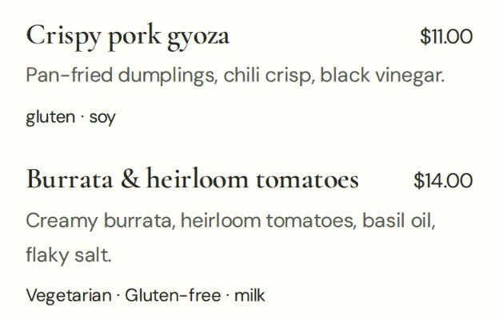
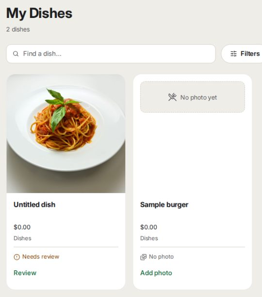
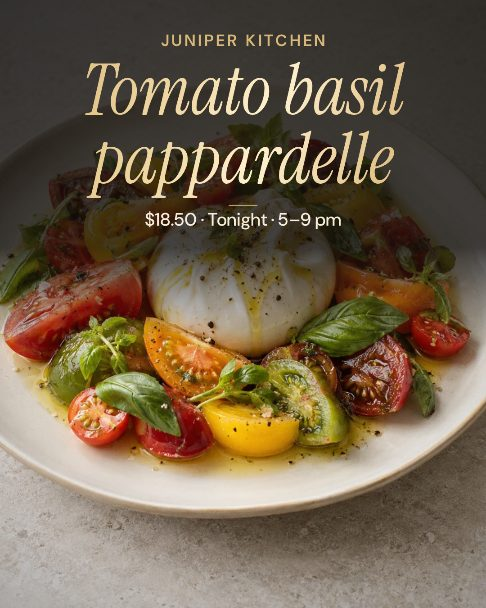
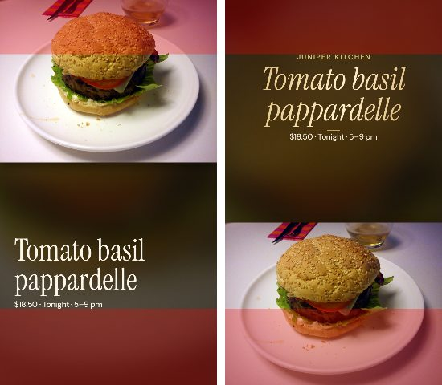
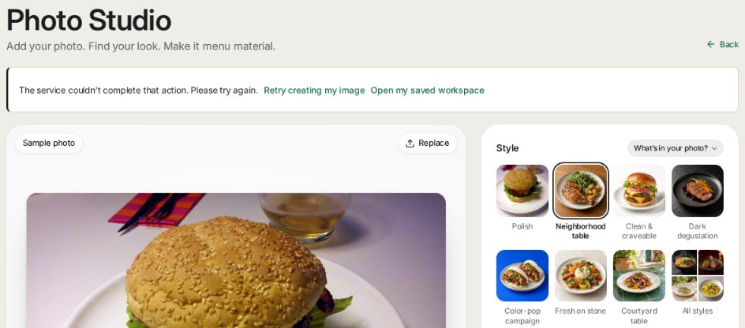

# Menu Material site review

Review date: September 25, 2026. Source: `63d31f7` (main after #12, "Show photo progress and default to medium image quality"). This follows the [September 24 site audit](SITE_AUDIT_2026-09-24.md) and the [Post Maker review](POST_MAKER_REVIEW_2026-09-24.md). Appendix A tracks every September 24 item.

## Fix status — added after the fixes

The fixes were merged into main in #14. The rest of this document describes the site as reviewed, before these fixes.

**In short:** nearly every finding is fixed. The main gaps left in code are the stylesheet split, resized guest-menu photos and the remaining lint errors. The rest needs you: payments, an email provider, Terms and a support address, CAPTCHA keys, and a few product decisions.

### How the fixes were checked

- `typecheck` passes. All 45 test suites pass, including 8 new ones, and `npm test` now runs them.
- Lint: 58 errors, down from 63; no new errors in changed code.
- `build` passes. On the production build under wrangler, with migrations applied:
  - security headers on pages and the API, with guest menus left embeddable;
  - `robots.txt`, `sitemap.xml` and `favicon.ico`;
  - real 404s for unknown menus;
  - signup, workspace navigation, publishing, and a guest menu with "Contains" labels, JSON-LD and 0 axe violations.
- In the browser, on the dev server:
  - guest sample → signup: the 875 KB sample transfers and stays a sample, and the time zone is saved;
  - a 2 MB phone photo uploads, and a GIF is refused before anything is created;
  - typed notes stay notes;
  - Menus: the sample isn't offered, the address field is labelled, and Share opens by itself only on the first publish;
  - the guest menu from a QR link: no hydration errors, one view per dish, allergens and the vegan filter, axe clean;
  - a lapsed session asks for sign-in in place and keeps unsaved edits;
  - account deletion;
  - axe on the public pages, including the showcase with reduced motion.
- A new browser check, `tests/menu-accessibility-guest.mjs` (15 checks, run by hand), covers the published guest menu.

### Status by section

| Section | Status |
|---|---|
| §2 H1–H6 | Fixed |
| §3 B1 Accounts | Partly fixed. Sessions renew while in use, and a 401 reopens sign-in in place. **Left for you:** password-reset and verification emails, a support address |
| §3 B2 Terms, deletion, privacy | Partly fixed. Account deletion is in Settings → Details, and the privacy page is accurate. **Left for you:** Terms and signup consent |
| §3 B3 AI budget | Fixed in code. Spend settles at measured cost, free accounts get 40 text AI calls a day, budgets follow the plan, and limits are keyed on the IPv6 /64. **Left for you:** CAPTCHA and email verification before the first AI call |
| §3 B6 Paying | Partly fixed. Plans is honest while billing is off and has a "Tell me when Pro opens" waitlist, and Pro is no longer capped at about 10 images a day. **Left for you:** payments |
| §3 Headers, takedown, README | Fixed |
| §4 Abuse and account security | Fixed |
| §5 Image creation and operations | Fixed |
| §6 Photo Studio and My Dishes | Fixed, except a Grubhub export: no verified size spec was found |
| §7 Menus and the guest menu | Fixed, with a few gaps: see "Still open in code" |
| §8 Post Maker and Campaigns | Fixed. Prices still use the browser's number format, because restaurants have no locale setting |
| §9 Marketing, SEO, settings | Fixed, except the stylesheet split |
| §10 Accessibility | Fixed |
| §11 Engineering | Fixed, except lint: see "Still open in code" |

### Found and fixed along the way

- **Links did nothing in production.** In the vinext production build, every `next/link` click fails (`navigateClientSide` is undefined). All of them are now plain links. Don't add `next/link` until vinext fixes it.
- **Adding dishes to a menu repeated section headings.** Dishes added from My Dishes now join the menu's section of the same name. The picker marks dishes already on the menu.
- **Shared menu links had no preview image** without `APP_ORIGIN`. They now fall back to the request's host, like the other public pages.
- **QR codes used whatever address the owner was on.** They now use `APP_ORIGIN`.
- **The homepage showcase couldn't be scrolled from the keyboard** with reduced motion on.

### Behavior changes to know

- In the menu builder, "Update dish library" now changes My Dishes only. Other menus and live copies keep their own wording and prices.
- A $0 price saved in My Dishes reaches drafts, where the publish checks stop it, but not live menus.
- Pasted and imported dishes stay unreviewed until the owner confirms them.
- Photo Studio never renames or rewrites an existing dish.
- WebP photos are accepted. GIF and AVIF are refused before anything is created.
- An old menu address keeps redirecting only if a menu was live on it, or if it's the signup address. An administrator can release one.

### Before deploying

- Set `APP_ORIGIN` in production. Canonical links, QR codes and link previews use it; without it they fall back to the request's host.
- Migration `0017` adds two columns. Sites applies checked-in migrations on deploy.
- New optional settings are documented in `.env.example`:
  - `IMAGE_COST_ESTIMATE_USD`;
  - `AI_TEXT_INPUT_USD_PER_MILLION_TOKENS` and `AI_TEXT_OUTPUT_USD_PER_MILLION_TOKENS`;
  - `AI_FREE_DAILY_TEXT_CALLS`;
  - `RUNNER_ONCE_SECONDS`.
- Files Cloudflare serves directly from `public/` don't get the new security headers; only worker responses do.

### Left for you

1. **Payments:** a Stripe account, products and keys, then turn billing on. Checkout, webhooks and plan budgets are already built.
2. **Email:** a transactional email provider, for password-reset and verification emails.
3. **Terms and support:** Terms of Service text and a support address. Signup consent and a `/terms` page follow from them.
4. **CAPTCHA:** Turnstile keys for signup and before the first AI call.
5. **Product decisions:**
   - fold Campaigns into Post Maker;
   - settle the four destinations;
   - settle the words Style and Brand;
   - add a restaurant locale setting for price formats.

### Still open in code

- **Stylesheet split by route:** skipped. The cascade depends on the order of 22 stylesheet imports.
- **Guest menus:**
  - Photos are now cacheable, but not yet resized or given a `srcset`.
  - A menu that fails to load still returns 200, because vinext gives pages no way to return a 5xx.
  - Guest session IDs are still chosen by the browser. Per-network caps limit inflation.
  - "Most seen dish" still favors dishes near the top; the stats now say so.
- **Lint:** 58 errors remain (the hook rules and `no-explicit-any`), and lint doesn't block CI yet.
- **Opportunities in §12:**
  - an activity log with undo for live changes;
  - an allergen filter and a printable allergen chart;
  - Post Maker from any photo;
  - server-issued guest sessions and a weekly digest;
  - a how-it-works strip and trust FAQ;
  - provenance metadata.
- **Dev server only:** it sometimes reports a `useId` hydration mismatch on public pages. The production build showed none in 20 loads.

## Bottom line

The site took a big step in a day:

- The homepage is server-rendered and about 88% lighter.
- Publishing checks catch zero prices and placeholder names.
- Photos come along onto menus.
- The guest menu has hours, diet filters and structured data.
- Every public page passes axe.
- The menu editor, the publish review and the share step are now genuinely good.

The most important problems now are different in kind: **facts that change on their way to guests without the owner seeing it**. Several paths write to dishes or live menus behind the owner's back:

1. **Notes become diet tags.** Typing "Veal jus" or "GF bun on request" in a dish's notes marks it **Vegetarian** or **Gluten-free**, on live menus and in the guest diet filter.
2. **Photo Studio renames dishes.** It writes "Untitled dish" and a blank or prompt-text description over a dish the owner renamed, and live menus follow.
3. **"Update dish library" publishes drafts.** In the menu builder, it puts the menu's unpublished edits on every live menu. Its own dialog says other menus are unaffected.
4. **Posts keep the first dish's facts.** Remove the burger from a post and the pasta photo is titled "The house burger · $16.50".
5. **Allergens don't follow linked dishes.** Allergen tags in My Dishes never reach imported menu items linked to those dishes.
6. **Guest menus don't say what's an allergen.** "Vegetarian · Gluten-free · milk" doesn't say that milk is an allergen.

Each is a small fix. Together they undermine the core promise of accurate, owner-approved facts, and three of them affect allergy and diet information. **Fix these first.**

The September 24 launch blockers that sit around the product are still open:

- **Accounts (B1, B2).** There are no Terms, support address, account deletion, email verification or self-serve password reset.
- **AI budget (B3).** Open signup can still drain the day's AI budget, now with caption calls alone.
- **Paying (B6).** There is still no way to pay. The default per-restaurant budget would also cap a Pro account at about 10 images a day.

Beyond those, the review found:

- abuse gaps: a site-wide login lockout, reset links that can't be revoked, fake alerts in the ops channel, and two loops that regenerate free images;
- reliability gaps in image creation;
- visit stats that undercount in-venue guests;
- a long tail of Post Maker, menu and Photo Studio fixes.

## How this was checked

- **Ran `63d31f7` locally on Node 24:** the dev server, plus the production build under wrangler (workerd). There's no OpenAI key here, so live image generation, captions and AI imports weren't run.
- **Walked the site** in headless Chromium at 1440×900 and 390×844:
  - homepage → guest Photo Studio with the sample → signup;
  - Photo Studio uploads;
  - My Dishes (added 8 dishes with photos, prices and dietary tags);
  - Menus: "Use my dishes", fixing the checks, publish, share and QR;
  - the guest menu on a phone;
  - Post Maker, Settings, Plans, a staff link and 404s.
- **Automated checks:**
  - axe-core on public pages, the guest menu and the main workspace screens;
  - HTTP checks with browser and link-preview-bot user agents;
  - page weights on the production build;
  - `typecheck`, `lint`, all 40 test suites and `build`.
- **Six parallel source reviews:** accounts and security, image creation, menus, Post Maker, Photo Studio and dishes, and the marketing site and workspace shell.
  - Findings were reproduced with scripts against `handle()` or the real render code, or traced end to end.
  - Every high-priority finding was re-checked for this report, in the browser or by reading the full code path.
- **Not covered:** live AI output, physical phones, screen readers, hosted production settings and headers, and legal review.

Effort is relative: **S** = a focused change, **M** = a coordinated feature, **L** = substantial work.

## 1. What improved since September 24 — keep it

- **Homepage** (B4 fixed):
  - Server-rendered for signed-out visitors.
  - 0.94 MB on desktop and 1.26 MB on a 3× phone (was 7.7 MB and 10.3 MB).
  - LCP about 270 ms locally.
  - CSS is 66 KB gzipped.
- **404s:** real 404 status codes with a branded page. `/m/<missing>` returns 404 with `noindex`.
- **Placeholder identity (B5 fixed):**
  - Restaurant name is required at signup.
  - The publish review checks for zero prices, placeholder names, sample dishes and duplicates, with no "I checked" box.
  - The menu address is chosen at first publish, and old addresses redirect.
- **Menus:**
  - "Use my dishes" brings approved photos ("7 photos are on the menu").
  - Sections come out in course order.
  - No dialog opens by itself.
  - Quick update changes a price or marks a dish sold out without publishing other draft edits.
- **Sharing:** per-placement links and QR codes (`?src=table`), a table card, and a "Guest access checked" confirmation.
- **Guest menu:**
  - Search, section chips, diet filter, hours and "open now", and contact links.
  - Restaurant/Menu JSON-LD, a share image and a canonical URL.
  - 0 axe violations.
- **My Dishes:** structured dietary and allergen tags on each dish.
- **Photo Studio:**
  - The finished photo is the hub.
  - Formats are named by use.
  - Channel rules and photo packs (517 checks).
  - A small job-status request replaces full `/api/state` polling.
- **Operations (B7 mostly fixed):** a readiness endpoint, alerts, error reporting, error pages, and "you can leave this page" shown only while the worker is healthy.
- **Visual details:** solid phone tab bar, plain dialog titles, one name for credits.
- **Security foundations hold:**
  - every route that takes an ID is scoped to the restaurant;
  - cross-site write checks;
  - hashed session and invite tokens;
  - Stripe webhook verification;
  - uploads checked by their file bytes;
  - public images served only if they're on a published menu.

<table><tr>
<td width="60%"></td>
<td width="40%"></td>
</tr></table>

*Publish checks now stop $0 prices, and the share step gives each placement its own link and QR code.*

## 2. Fix first: wrong or unclear facts reaching guests

### H1. Typing a note can mark a dish Vegetarian or Gluten-free — High (S)

**Problem**
- "Other notes" is re-read on every keystroke, and short synonyms ("v", "veg", "vg", "gf", "df") become tags.
- The first letter of "Veal jus" becomes **Vegetarian**. "GF bun on request" becomes **Gluten-free**. "Vg option, ask server" becomes Vegetarian and Vegan.
- The tag stays after the note is finished. The chips light up, but nothing says why.
- The dish then:
  - appears under the guest "Suitable for" filter;
  - prints V or GF on the PDF menu;
  - gets schema.org `suitableForDiet`.
- Edits in My Dishes reach live menus at once. The same picker is used in the menu editor.

**Evidence**
- `app/components/dietary-picker.tsx:103-114` normalizes `[...tags, ...typed]` on each change.
- The synonyms are in `lib/dietary.ts:43-66`.
- Reproduced in My Dishes: typing "Veal jus, GF bun on request" and saving stored `["vegetarian","gluten-free","Veal jus","GF bun on request"]`.

**Fix**
- Store note text exactly as typed.
- Map synonyms only for legacy data, or on blur when a whole entry equals a synonym.
- Add a test that types notes one character at a time.

### H2. Photo Studio overwrites the dish's name and description, live menus included — High (S)

**Problem**
- Creating, re-creating or approving a photo saves the dish with the studio draft's name and description.
- In photo mode the studio has no name field, so the name becomes "Untitled dish".
- The description comes from the studio's own text, which can be image-prompt wording like "on slate, 45° angle".
- The save runs through the dish sync, so every menu item showing the old name follows, including live menus.

**Failure**
1. Upload a photo in Photo Studio.
2. Rename the dish "Margherita" in My Dishes and publish it on a menu.
3. Return to the result and choose Download → Approve.
4. The dish and its live menu item become "Untitled dish" with an empty description.

**Evidence**
- `app/components/photo-studio.tsx:513-532`: `ensureDish` spreads the saved dish, then overrides `name` and `description` from the draft.
- It runs from `generate()` (:603) and `approve()` (:661).
- `lib/server/api.ts:1274-1275` → `syncDishToMenus` (`lib/server/menu-documents.ts:1105-1161`) updates drafts and published copies.

**Fix**
- For an existing dish, don't send name or description from the studio; read them from `state.dishes`.
- Keep the image prompt separate from the dish description.

### H3. "Update dish library" publishes a menu's unpublished edits to every live menu — High (S)

**Problem**
- In the menu builder, "Update My Dishes" says: "Other saved menus keep their own prices and wording."
- It then saves the dish, and the server's dish sync rewrites the **live** copy of every menu that still shows the old value. That includes the menu being edited.
- The response listing changed menus is ignored. The toast only says "Dish library updated".
- This breaks "Your draft stays private until you publish."

**Failure**
1. Dinner and Lunch are both live with Burger at $12.
2. Change Burger to $14 in the Dinner draft, without publishing.
3. Choose Update dish library.
4. Both live menus now show $14.

**Evidence**
- `app/components/menu-studio.tsx:1494-1556`
- `lib/server/api.ts:1274-1275`
- `lib/server/menu-documents.ts:1125-1161`: the update is applied to `published`.

**Fix**
- From the builder, update My Dishes and drafts only, or list the live menus that will change and ask first.
- Show `result.menus`, and correct the dialog text.

**Related:** a $0 price saved in My Dishes goes live the same way, even though publishing would refuse it (`lib/menu-checks.ts:115-123`).

### H4. Post Maker keeps the first dish's name, price and description — High (S)

**Problem**
- Title, description and price are set only when the first dish is picked.
- Reordering or removing dishes leaves them unchanged, and removing and re-adding is the only way to swap a dish.
- With three dishes, 9 of 10 designs title the post with the first dish's name and price.

**Failure**
1. Pick the burger ($16.50).
2. Add the pasta.
3. Remove the burger.
4. The pasta post is titled "The house burger · $16.50", its caption describes the burger, and no warning shows.

**Evidence**
- `app/components/post-maker.tsx:241-259` and `:621-660`
- `lib/post-composition.ts:256-258`
- `lib/post-flow.ts:47-56`
- Rendered with the real renderer.

**Fix**
- Track which fields the owner edited, and re-derive the others when the lead dish changes or is removed.
- For multi-dish posts, default to a group headline that lists the items.

### H5. Allergen tags never reach imported menu items linked to My Dishes — High (S)

**Problem**
- When a pasted or imported menu item is linked to an existing dish, only the dish ID and photo are copied.
- Imported items start with no tags.
- Later tag edits in My Dishes don't reach them either, because the sync only updates items whose tags matched the dish's old tags.

**Failure**
1. "Satay skewers" is marked Contains peanuts in My Dishes.
2. The owner pastes a menu, and the item links to the dish and gets its photo.
3. The live item shows no allergen.
4. Adding sesame to the dish later updates zero menus.

**Evidence**
- `lib/server/menu-documents.ts:339-351` and `:403-428`
- `app/components/menu-studio.tsx:1713-1737`
- `lib/menu-checks.ts:271-275`
- Reproduced by script.

**Fix**
- Copy the dish's tags when linking an item that has none.
- Treat an import's empty list as "not set".

### H6. Guest menus don't say which tags are allergens — Medium (S)

**Problem**
- Items read "gluten · soy" or "Vegetarian · Gluten-free · milk". Nothing says that "milk" means *contains* milk.
- Diet tags are capitalized and allergens aren't.
- The printed legend explains only V, VG and GF.
- A dish tagged only Vegan disappears when a guest filters by Vegetarian (`app/components/menu-document-view.tsx:294-311`).

**Fix**
- Label allergens "Contains:" (or use an icon plus a legend), and use consistent capitals.
- Treat vegan as meeting the vegetarian and dairy-free filters.
- Add a standard "Tell your server about allergies" note.

## 3. Launch blockers still open from September 24

**B1. Account recovery, email verification and support (M)** — still open.
- The sign-in dialog still says "Automated password-reset emails are not available yet" (`app/components/auth.tsx:262`).
- There's no email verification.
- There's no support address anywhere; `/contact` returns 404.
- **New: sessions end exactly 7 days after sign-in,** even while in use, and the app has no 401 handling (`lib/server/core.ts:175-186`, `lib/client.ts:28-37`).
  - Mid-service, an owner marking a dish sold out gets "Sign in to your restaurant workspace."
  - Every autosave then fails until a manual reload.
  - **Fix:** extend sessions that are in use, and reopen sign-in in place on a 401.

**B2. Terms, consent, account deletion and an accurate privacy page (M)** — still open.
- `/terms` returns 404, signup asks for no consent, and there's no account deletion.
- The privacy page (`app/privacy/page.tsx`) is inaccurate:
  - **Newly wrong:** "Background image requests retain a provider response so an interrupted job can be recovered" (:63-64). Images are now direct calls that can't be fetched again.
  - Still wrong: pre-signup photos stay in "the current browser tab" (:29). They're kept in IndexedDB for 24 hours.
  - Still wrong: recovery data is described as tab-only. Menu recovery drafts are in `localStorage`.
  - It still reads "Updated September 16".

**B3. Open signup can drain the whole day's AI budget — now with captions alone (M)** — still open.
- **Reservations are never corrected.** `finishAi` records status and usage but never corrects `reserved_cents` (`lib/server/safeguards.ts:29-106`).
  - A caption reserves $0.10 and costs about $0.0003, but still counts $0.10 against the $100/day site budget and the $20/day restaurant budget.
- **Five throwaway accounts are enough.** Five accounts at the hourly caption limit reserve the whole site budget in about 4 hours (reproduced by script).
  - After that, every restaurant's AI calls get "Today's AI budget has been reached".
  - Queued images are re-queued every minute until midnight UTC.
- **Signup limits are easy to get around:** they're per IP, and keyed on the full IPv6 address.
- **Fix:**
  - correct reservations to real usage;
  - separate free and paid budgets;
  - a daily cap on non-image AI for free accounts;
  - Turnstile and email verification before the first AI call.

**B6. No way to pay; free users hit a dead end (M)** — still open.
- At 0 images, "View plans" opens a dialog offering "Continue free" and "Subscriptions open soon. Start with 5 free images today." (`app/components/plan-cards.tsx:49,92`).
- Renewal fine print shows even though billing is off.
- The $20/day restaurant default at $2 per image caps Pro at about 10 images a day (`db/schema.ts:55`; reproduced: the 11th image was refused).
- **Fix:** at minimum a waitlist or contact action, and budgets set by plan.

**Also still open:**
- The app sets no security headers (no CSP, HSTS, `frame-ancestors` or Referrer-Policy). Confirm what the host adds.
- There's no admin takedown for public menu pages.
- `README.md` still says "invitation-only, capped at 10" and "There is no billing", and credits the hero burger to the wrong photographer.

## 4. Abuse and account security — Medium

1. **One attacker can block every sign-in and signup** (S–M).
   - The global rate-limit buckets count cheap, invalid requests before validation.
   - Per-IP keys use the full IPv6 address.
   - About 100 requests a minute from one /64 locks everyone out.
   - Evidence: `lib/server/safeguards.ts:107-124`, `lib/server/core.ts:145-160`, `lib/server/api.ts:677-681` and `:740-752`.
   - Fix: key limits on the /64, count only requests that pass validation, and slow down per email instead of using a global lockout.
2. **Password-reset links can't be revoked** (S).
   - Issuing or using a new link leaves older ones valid.
   - Admin bootstrap invites made before an admin existed still create admins later.
   - Evidence: `lib/server/api.ts:184-226` and `:999-1012`.
   - Fix: void other unused resets for that email; re-check "no admin exists" when an invite is used; add a list-and-revoke view.
3. **Anonymous browser error reports reach Slack or Discord word for word** (S).
   - "@everyone" and links pass through.
   - Thirty fake reports an hour use up the shared cap, so real 500s aren't delivered.
   - Evidence: `lib/server/api.ts:598-599`, `lib/server/monitoring.ts:135-145` and `:286-330`.
   - Fix: accept reports only from same-origin requests or signed-in sessions, give them their own cap, escape `<`, `@` and links, and set `allowed_mentions`.
4. **Free images regenerate** (S). Each loop works 3 times per 30 days per account.
   - Reporting a free correction as still wrong restores a credit automatically (`lib/server/photo-corrections.ts:125-134`).
   - Cancelling a queued free correction also restores one (`lib/server/api.ts:1455-1474` → `lib/server/correction-policy.ts:47-55`).
   - This contradicts "5 free images, once per account".
5. **A full workspace still triggers paid image calls.** When storage is full, the image is made, thrown away and not counted (`lib/server/generation.ts:700-709`, `:991-1003`). Check storage before the call.
6. **Smaller issues:**
   - Menu addresses can be squatted, because every change keeps a permanent redirect (`lib/server/menu-address.ts`).
   - Signup reveals registered emails and stays in signup mode; offer "Sign in instead" with the email kept.
   - Unchecked IDs return 500s that trigger the error-burst alert (`lib/server/api.ts:1279-1286`, `:1481-1490`).
   - A saved photo style later removed from the catalog makes `/api/state` return 400 and locks the workspace. Use `safeParse` on stored data (`lib/server/api.ts:797`).
   - scrypt runs with default settings and no version marker (`lib/server/core.ts:31-40`).
   - Staff links list archived and sample dishes, and share the owner's upload limits (`lib/server/menu-tools.ts:69-76`).

## 5. Image creation and operations — Medium

1. **One failed database write can leave a job "processing" forever** (S).
   - Photo Studio stays at 98% ("Taking longer than usual"), New photo and Try again stay disabled, and every open page keeps polling every 2 s.
   - Evidence: `lib/server/generation.ts:629-651`, `:855-875`, `:1063-1065`, `:1087-1092`; `app/components/photo-studio.tsx:189-200`.
   - Fix: have `tick()` recalculate a job's status from its finished images, and have the page decide "running" from unfinished images.
2. **OpenAI rate limits, 503s and moderation refusals fail the photo permanently** (S–M).
   - The owner sees the generic "Image creation failed", with no backoff (`lib/server/generation.ts:546-567`, `:1007-1034`).
   - Try again resends the identical refused request.
   - Fix: retry 429 and 503 with Retry-After, alert on `insufficient_quota`, and explain `moderation_blocked`.
3. **One image's database error ends the check early** and can cut off another paid call started in the same check (`Promise.all` plus a single `waitUntil`, `lib/server/generation.ts:1077-1083`). Use `allSettled` and keep each image alive separately.
4. **The README's once-a-minute scheduler** starts at most 2 images a minute across the site, and pages defer to it because it looks healthy (`README.md:45`, `lib/server/generation.ts:863-875`).
5. **Without a worker, background tabs stop starting queued work** while the screen says "Keep this page open" (`lib/job-progress.ts:10,55`).
6. **Low:**
   - A cut-off call shows "Creating…" for about 3.5 minutes, and its spend is never marked `uncertain`.
   - A failed daily budget alert is never retried after 00:55 UTC.
   - Every worker check scans the whole `outputs` table twice; there's no index on `response_id`.
   - The progress bar can jump backwards, and the card and side panel disagree about "taking longer".
   - Images held by the budget or a pause show contradictory messages.
   - Description-only images get a prompt about a photo that doesn't exist ("Keep the original camera angle").

## 6. Photo Studio and My Dishes — Medium

1. **A guest's "Try a sample" still becomes a real "Sample burger · $0.00" dish after signup** (S).
   - `lib/guest-studio.ts:48-59` creates the dish without the draft's `sample` flag (`app/components/guest-studio.tsx:257`).
   - "Use my dishes" then adds it to menus, the sample check doesn't fire (only the $0 check stops publishing), and Post Maker lists it once approved.
   - In this walkthrough, the failed transfer also left a sample dish with no photo.
2. **An illustration can be exported to DoorDash.** A result's "real photo" status and size come from the editable draft, not from the photo itself.
   - Example: "Use a real photo instead" → Back to result enables delivery-app exports for an illustration.
   - Evidence: `app/components/photo-studio.tsx:201`, `:796`, `:1367`, `:1466`.
3. **Older real photos start being treated as illustrations** after a restaurant makes more than 100 newer image requests, because `/api/state` returns only the latest 100 jobs (`lib/server/api.ts:823,828`; `lib/photo-destinations.ts:75-84`). Packs then skip DoorDash, Uber Eats and Google.
4. **WebP and GIF pass the browser check but the server rejects them** after the dish has been created.
   - Drag-and-drop bypasses the picker's file filter, and AVIF is detected as HEIC.
   - Guests only find out after signing up, with a "Retry creating my image" that can never work.
   - Evidence: `lib/client.ts:48-101`, `lib/server/api.ts:392-444`.
   - Fix: convert to JPEG in the browser, or reject before creating anything.
5. **Quick adjustments save enlarged crops** that then pass delivery-app minimum sizes (`app/components/photo-studio.tsx:672-689`).
6. **Screen readers aren't told when a photo is ready or has failed** (`app/components/studio-onboarding.tsx:217-225`).
7. **A failed "Change the setting with AI" loses the edited photo**, and Try again after a reload restyles the original instead (`app/components/photo-studio.tsx:638-644`, `:749-760`).
8. **After sign-in or signup from the guest studio, the page stays half signed in.** Workspace controls do nothing, and the header still says "5 free images", hard-coded (`app/components/guest-studio.tsx:305-307`). Seen after signup in this walkthrough; the sticky Create bar also clips the Format choice there.
9. **Low:**
   - On phones the guest studio's Create bar covers Details.
   - "Apply to more dishes" always makes square photos.
   - A photo deleted in My Dishes still shows in the studio.
   - The My Dishes bulk download still asks for approval per photo per destination, and one small photo aborts the ZIP.
   - "Draft saved" shows on an empty studio, and the save status is announced constantly.
   - Copy problems:
     - "Approve and download" opens a second dialog.
     - "Browse all looks → Saved" doesn't exist.
     - The HEIC error mentions a "Take a photo" control that doesn't exist.
     - "Sized for DoorDash item photo" vs "Wide".
     - A cancelled image shows as "couldn't be created".
   - A blank dish name shows a raw validator message, and a blank section is accepted.
   - New dishes default to a price of 0 and show "$0.00".
   - Dropping a photo outside the canvas leaves the app, and pasting isn't supported.
   - There's no Grubhub or Instagram 3:4 export.
   - A "No photo yet" card leaves a large blank area.

## 7. Menus and the guest menu — Medium

1. **Visit stats undercount in-venue guests** (S).
   - Each open guest tab re-sends its dish views every 20 s (`app/components/menu-document-view.tsx:261-284`); 6 requests in 50 s for 2 visible dishes were observed here.
   - All guest events share one limit of 300 an hour per restaurant and IP (`lib/server/menu-tools.ts:754-757`).
   - Tables on the restaurant's Wi-Fi use it up in minutes, and later visits are dropped with 429.
   - Fix: send each dish view once per page load, batch views, and limit each kind separately.
2. **Guest events can be inflated and are never pruned.**
   - Rotating session IDs inflates counts.
   - The owner's own test visits count.
   - Old events are never removed (`lib/server/menu-tools.ts:712-773`).
3. **Republishing the main menu doesn't make it main again.** After taking it offline and republishing, another menu stays on the main QR code (`lib/server/menu-documents.ts:978-987`, `:1073-1082`).
4. **A special published before any menu takes the main slot.**
   - Guests then see an empty main menu (`lib/server/promotions.ts:394-405`).
   - The specials path also skips the placeholder-name check.
5. **"Open now" uses New York time** for every restaurant that never set a timezone (`db/schema.ts:43`). Detect it from the owner's browser.
6. **Photos the owner reported as inaccurate are still used.** They're attached to menus automatically (`lib/server/menu-documents.ts:319-327`) and offered in Post Maker (`app/components/post-maker.tsx:1133-1135`).
7. **The paste parser misreads common layouts** (`lib/menu-paste.ts:12-14`, `:41-46`, `:155-164`):
   - title-case headings;
   - years as prices ("Chateau Margaux 2015" becomes $2,015.00);
   - price ranges.

   Misread rows are marked reviewed and linked to My Dishes automatically.
8. **Guest menu photos are slow on phones.** They're full size (up to 2048 px, JPEG quality 95), have no `srcset`, and are sent with `Cache-Control: no-store` (`lib/server/api.ts:568`). That's several MB per visit on mobile data.
9. **Settings changes don't reach live menus, but Menus says they're up to date.** Name, logo, color and currency changes wait for a republish, while Menus shows "Published · up to date".
10. **The guest menu has a hydration error when opened from a QR link** (`?src=table`). React reports mismatched `aria-controls` IDs on the search box, diet filter and section chips. Reproduced in the browser; the cause wasn't identified.
11. **Low:**
    - JPY prices show "¥1,200.00", and Japanese and French number formats put characters the menu font lacks into PDFs.
    - Course ordering matches parts of words: "Steaks" sorts with drinks because it contains "tea".
    - AI import is all-or-nothing, shows raw validation text, and tells menus over 60 dishes that the photo is unclear.
    - An unknown `?menu=` or a load error returns 200.
    - A diner opening an offline menu gets the owner-facing 404 ("See pricing").
    - "Most seen dish" is effectively the first dish on screen, and each menu's header shows the restaurant-wide view total.
    - QR codes are built from `location.origin`.
    - Possessive names give addresses like "joe-s-diner".
    - The Share dialog opens by itself after every republish.
    - The guest menu switcher navigates as soon as its value changes.
    - The whole guest menu re-renders every second while a special is live.
    - The top photo is shown with grey bars on both sides.

## 8. Post Maker and Campaigns — Medium

<table><tr>
<td width="47%"></td>
<td width="53%"></td>
</tr></table>

*Left: the Nightcap still darkens the top of the dish (about 75% black). Right: in Stories, busy phone photos are pinned into the areas Instagram's bars cover (red). The text stays in the safe area.*

1. **Switching designs discards the owner's text** (S).
   - The small heading, call to action, text amount, name toggle and typeface all reset.
   - After a type or color tweak, the restaurant's colors are replaced by the template's for every later switch.
   - Evidence: `lib/post-templates.ts:195-203`, `app/components/post-maker.tsx:860-887`.
2. **The Nightcap still lays a ~75% black gradient over the dish** (`lib/post-designs.ts:942-946`, `lib/post-kit.ts:1080-1115`). The Post Maker Phase 1 status lists this as done.
3. **Busy phone photos in full-bleed Stories sit under Instagram's bars** (`lib/post-designs.ts:499-504`, `lib/post-kit.ts:537-546`).
4. **Carousels leave out price, date and call to action** unless "Start with a cover" is on, and it's off by default in a collapsed section. An event's required date never appears, yet export passes.
5. **The Daily special price seal fails on ordinary prices** like "CA$18.50", "CHF 24.50" or "$1,250.00".
   - It says to shorten the price, and export of every format is blocked (`lib/post-designs.ts:685-722`).
   - Prices are formatted in the browser's locale, not the restaurant's (`lib/client.ts:114-119`).
6. **The placeholder restaurant name stays in the caption** after the owner fixes the name (`lib/post-flow.ts:41-95`).
7. **Any framing tweak blocks export after a custom caption** ("Review your caption after the details changed"), although no fact changed.
8. **Campaigns contradicts Post Maker.** It's still in More tools and:
   - prints $0.00 prices and uses Arial;
   - puts text under Instagram's Story bars;
   - its package checkbox approves every unapproved photo (`app/components/promotion-workspace.tsx:82`, `:1290-1299`).
9. **Transparent logos are flattened onto white at upload** (`lib/client.ts:91-99`). Posts and menus load that copy (`lib/post-composition.ts:231`, `lib/server/api.ts:1318`), so logos show in a white box on dark designs. Wide logos are also squashed (`lib/post-designs.ts:220-223`).
10. **Low:**
    - Older drafts plus "Tall 3:4" give a stretched preview and a 4:5 file labelled 3:4.
    - "Description for your caption" is printed on the image in three designs.
    - Framing the cover also changes the first dish's slide.
    - A deleted photo shows "could not be opened, try again".
    - Chinese, Japanese and Thai headlines render at minimum size, because lines only break at spaces.
    - Screen-reader and file names:
      - previews are announced as "feed design preview";
      - thumbnails contain alerts;
      - files are named `feed.png`.
    - The pack download isn't tracked.
    - Unavailable or archived dishes aren't flagged.
    - Scratch canvases are never released (a memory risk on iPhones).

## 9. Marketing site, SEO, settings and performance — Medium

1. **Errors from Settings are hidden** (S).
   - Logo and style-reference upload errors, and sign-out errors, go to the global banner.
   - That banner sits under dialog overlays and the phone tab bar (`app/components/home-client.tsx:155-168`, `app/workspace.css:15-26`).
2. **SEO basics are still partly missing:**
   - `/robots.txt` and `/sitemap.xml` return 404.
   - Marketing pages have no canonical URL, `og:url` or `metadataBase`.
   - `/pricing`, `/privacy` and `/guidelines` inherit the homepage's share titles.
   - There's no JSON-LD on `/`, and `/favicon.ico` returns 404.
   - The share image appears only when `APP_ORIGIN` is set on the app (`app/layout.tsx:29-40`). It's a 1.9 MB 1536×1024 PNG; WhatsApp is reported to skip images over about 300 KB, and 1.91:1 is the expected shape.
   - Metadata is streamed into `<body>` for browsers and Googlebot. Preview bots (Slack, Facebook, WhatsApp) get it in `<head>`, as checked with their user agents.
3. **Explore promises "Your food and portion stay the same" and "never your food"** as a guarantee (`app/components/explore-gallery.tsx:454`, `:665`, and the style library). That contradicts the guidelines and the app's own "Report a food change" flow. Word it as intent.
4. **One 380 KB stylesheet (66 KB gzip) loads on every route,** guest menus included, up from 342 KB. Split it by route.
5. **Explore downloads full-size images on sharp screens.** Tiles jump from a 400 px to a 1254 px image, about 11 MB on high-density screens (`app/components/explore-gallery.tsx:324-329`).
6. **`public/` ships about 20 MB of unused files.** One of them, `public/og.png`, is branded "Dishlight", an old product name, and anyone can open it at `/og.png`.
7. **Stale tabs after a deploy.** A missing code chunk sends people to "Try again" or "Check your connection" screens that can't recover. Plausible; it depends on whether the host keeps old files.
8. **Homepage style gallery labels differ by screen size.** On phones the visible label ("Color") isn't part of the accessible name ("New backdrop"), which fails WCAG 2.5.3.
9. **Low:**
   - Settings:
     - the timezone and tone fields refill as soon as they're cleared, and tone appears twice;
     - clearing an hour shows "Invalid";
     - the address-change confirmation never shows;
     - the logo field is a native "Choose File" input.
   - Two billing bugs will appear once Stripe is on: signup reads the wrong flag, and `?upgrade` is never cleared.
   - Signing in shows three different placeholders in a row.
   - Info pages have no Log in, and phones hide Pricing.
   - The homepage buttons do nothing until JavaScript loads.
   - The kitty animation runs forever, and its "zzz" ends up in extracted text.
   - The footer year can mismatch at New Year.
   - An invalid staff link still offers "Try opening again".
   - There's still no how-it-works strip or trust FAQ.

## 10. Accessibility

- **0 axe violations** on the homepage, pricing, privacy, guidelines, the 404 page, the guest menu, My Dishes, Add a dish, Plans and Settings.
- **Issues found:**
  - The first-publish "Menu address" input has no label (critical).
  - The Menus empty-state text (3.62:1) and the share dialog's QR caption (3.09:1) fail contrast.
  - The menu editor nests a `main` inside another `main`.
  - Post Maker's dish tiles read each name twice.
- **Also:**
  - A finished or failed photo isn't announced (§6).
  - A visible label is missing from its accessible name (§9).
  - The guest menu switcher changes the page on select (§7).
  - "Draft saved" is announced constantly.
  - Post Maker thumbnails contain alerts.

## 11. Engineering

**The dev server rejects photo uploads over about 1 MB — Medium (S), local only**

- **Why:** vinext treats every multipart POST without an action ID as a server-action form submission, and applies the 1 MB server-action body limit before the route handler runs. The client sends the original photo plus a 2048 px copy in one request.
- **Effect locally:**
  - A real 2 MB phone photo fails with the generic "The service couldn't complete that action. Please try again."; the 413 body isn't JSON, so the client can't show a better message.
  - The guest → signup transfer of the 875 KB sample fails the same way, leaving a sample dish with no photo.
- **Production today:** not affected. The app has no server actions, so the production build leaves that handler out. Under wrangler, 1.1–5 MB bodies reached the app in 12 of 12 repeated requests; two earlier 503s were local worker restarts.
- **Risk:** adding a single server action would put the 1 MB limit on production uploads.
- **Evidence:** `node_modules/vinext/dist/server/app-server-action-execution.js:438-458` and `app-rsc-handler.js:460`. The test suites call `handle()` directly, so they couldn't catch this.
- **Fix (validated):** set `experimental: { serverActions: { bodySizeLimit: "32mb" } }` in `next.config.ts`. With that, the 2 MB photo uploaded (201) in dev. Also:
  - map non-JSON 413 responses to "This photo is too large…" in `lib/client.ts`;
  - add one upload test that goes through the framework.

**Other engineering items**

- **Lint:** 63 errors and 96 warnings (was 70 errors): 17 `set-state-in-effect`, 9 refs read during render and 36 `no-explicit-any`. Fix the hook errors, then make lint block CI.
- **`npm run test:photo-preview` fails on Linux.** Its exact-pixel SHA-256 fixtures depend on the platform's canvas build; compare with a tolerance (PSNR) instead.
- **Test artifacts** are written to `/private/tmp`, a macOS path.
- **`POST /api/creation-events` returns 400** ("The activity belongs to unavailable work.") on the first workspace load after signup. This was also noted on September 24.

## 12. Opportunities

**Product**

1. **A safety net for changes that go live.** Dish sync, quick updates and settings now change live menus in several ways.
   - Add a short activity log on Menus, such as "Burger price changed to $14 on Dinner and Lunch · Undo".
   - Ask before an edit made in one place changes a live menu somewhere else.

   Bugs like H2 and H3 would then be visible and reversible, and owners would trust the sync.
2. **Allergy-safe guest menus.** The structured data is already there. Add:
   - "Contains" labels with icons and a legend;
   - an allergen filter ("hide dishes with peanuts");
   - a standard allergy note;
   - a printable allergen chart.
3. **Accept any photo:**
   - convert WebP, GIF and AVIF in the browser;
   - allow drop and paste anywhere in the studio;
   - write errors that name the supported types and sizes.
4. **Stats owners can trust:**
   - guest sessions issued by the server;
   - separate limits for each event type;
   - exclude signed-in owners;
   - roll up old events;
   - then a weekly digest ("Table QR brought 42 visits; the burrata was viewed most").
5. **Finish the September 24 simplification.**
   - Fold Campaigns into Post Maker, with its offer types as purposes; today it undercuts Post Maker's quality and checks.
   - Settle on two words: Style (for one photo) and Brand (for the restaurant).
6. **Let Post Maker start from any dish photo** and ask for approval at export. Default multi-dish posts to a group headline.
7. **Set timezone and locale once,** at signup, from the owner's browser. Format prices in the restaurant's locale in posts, menus and PDFs, with each currency's own decimals.

**Engineering and performance**

8. **Lighter pages:**
   - split CSS by route (marketing, workspace, guest menu);
   - resized, cacheable guest-menu photos with `srcset`;
   - fix the Explore `srcset`.
9. **Resilience:**
   - recover from missing chunks ("A new version is available — Reload");
   - reopen sign-in in place on a 401;
   - extend sessions that are in use.
10. **Cost control:**
    - correct reservations to real usage;
    - set budgets by plan;
    - cap non-image AI calls per day for free accounts;
    - require a CAPTCHA and email verification before the first AI call.

## 13. Suggested order

1. **This week (all S):**
   - H1–H6;
   - the guest sample flag;
   - the Nightcap gradient;
   - Post Maker's design-switch data loss and price seal;
   - logo transparency;
   - dish views re-sent every 20 s;
   - the dev upload limit and a friendly 413 message.
2. **Before opening signup:**
   - B1, B2 and B3;
   - B6, or at least a waitlist and budgets set by plan;
   - the abuse fixes in §4;
   - security headers and public-page takedown;
   - 401 handling and sessions that stay alive while in use.
3. **Next:**
   - image-creation reliability (§5);
   - menus (§7);
   - the rest of Post Maker (§8);
   - SEO basics (§9).
4. **Then:** the opportunities in §12.

## Appendix A — status of September 24 items

As of the review, before the fixes. See "Fix status" at the top for what has changed.

**Launch blockers**

| Item | Status | Notes |
|---|---|---|
| B1 Account recovery, verification, support | Open | See §3; 7-day hard session expiry is new |
| B2 Terms, consent, deletion, privacy page | Open | Privacy page has a newly wrong sentence |
| B3 AI budget drain | Open | Captions alone can drain it; reservations never corrected |
| B4 Homepage server rendering | Fixed | |
| B5 Placeholder identity | Fixed | Gaps: specials path; "Untitled dish" isn't flagged |
| B6 No way to pay | Open | Dead-end dialog; Pro capped at about 10 a day by the default budget |
| B7 Operations | Mostly fixed | Gaps in §4 (3) and §5 |

**High priority**

| Item | Status | Notes |
|---|---|---|
| Moderation, takedown | Open | |
| SEO basics | Partly fixed | Real 404s, page titles, guest-menu metadata done; robots, sitemap, canonical and per-page share titles missing |
| Image weight | Fixed | 0.94 MB homepage on desktop |
| Owner analytics | Partly fixed | New menu stats undercount (§7); creation-events 400 |
| Security headers | Open | |
| Stale README | Open | |

**Design**

| Item | Status | Notes |
|---|---|---|
| One control family | Partly fixed | Shared controls and tokens; CSS grew to 380 KB |
| Plain dialog titles | Fixed | |
| One status vocabulary | Fixed | |
| Phone tab bar | Fixed | |
| Homepage details | Partly fixed | Log in on info pages, Terms and Contact links, how-it-works, FAQ and gallery labels still open |
| Small polish | Partly fixed | Format names, share spacing, "10 designs" and "All styles" fixed. "Draft saved" on empty screens, native logo input, staff-link copy and "feed" labels remain |

**Simplify**

| Item | Status | Notes |
|---|---|---|
| Four destinations | Open | Explore, More tools and Campaigns remain |
| Ask for the format once | Partly fixed | Single downloads fixed; bulk download unchanged |
| Finished photo as the hub | Fixed | |
| Fewer interruptions in Menus | Fixed | Course ordering has a word-fragment bug |
| Post Maker from any photo | Open | |
| Samples out of real data | Partly fixed | Workspace path fixed; guest path not (§6) |
| Automatic publish checks | Fixed | See B5 gaps |
| Lighter signup | Open | 12-character password; no magic link or Google sign-in |

**Improve existing features**

| Item | Status | Notes |
|---|---|---|
| Channel rules and warnings | Fixed | |
| Provenance metadata (C2PA/IPTC) | Open | |
| Dishes as the source of truth | Fixed | But see H2 and H3 |
| Sold out today | Fixed | Quick update |
| Structured dietary tags | Fixed | But see H1, H5 and H6 |
| Photos carried onto menus | Fixed | |
| Restaurant info on the guest menu | Fixed | Timezone default issue (§7) |
| Share image, structured data, real 404 | Fixed | |
| Post Maker 3:4 and Story safe zones | Fixed for text | Photo placement in Stories still open |
| Per-placement QR codes | Fixed | |
| Job polling | Fixed | |
| Section as free text in My Dishes | Open | |
| Lint | Partly fixed | 70 → 63 errors |
| Unused files in `public/` | Open | About 20 MB |

## Appendix B — measurements

| Check | Result |
|---|---|
| `npm run typecheck` | Pass |
| `npm run lint` | 63 errors, 96 warnings |
| Test suites | 39 of 40 pass, including `test:menus`, `test:templates`, `test:exports`, `test:workspace-exports` and `test:web-assets`. `test:photo-preview` fails on Linux (exact-pixel fixture) |
| `npm run build` | Pass |
| Homepage, production build, before scrolling | 942 KB on desktop at 1×, 1,256 KB on a phone at 3×; LCP about 270 ms locally |
| CSS | One 380 KB file (66 KB gzip) on every route |
| JavaScript, signed-out homepage | About 216 KB transferred |
| axe | 0 violations on public pages and the guest menu; workspace issues in §10 |
| HTTP | `/`, `/pricing`, `/privacy`, `/guidelines` 200. `/terms`, `/robots.txt`, `/sitemap.xml`, `/favicon.ico`, `/m/<missing>` 404. `/pilot` 308 → `/pricing` |
| Page metadata | In `<head>` for Slack, Facebook and WhatsApp; streamed into `<body>` for browsers and Googlebot |
| Upload size | Dev: multipart bodies over about 1 MiB get 413 before the app. Production build: 1.1–5 MB accepted |

## Appendix C — how the key bugs were reproduced

- **H1:**
  1. My Dishes → open a dish.
  2. Type "Veal jus, GF bun on request" in Other notes, then Save details.
  3. Vegetarian and Gluten-free are selected and stored.
- **H2:**
  1. Photo Studio: upload a photo.
  2. My Dishes: rename the dish and publish it on a menu.
  3. Back in Photo Studio: Download → Approve.
  4. The dish is "Untitled dish" again, on the menu too. Traced through `ensureDish` → `POST /api/dishes/:id` → `syncDishToMenus`.
- **H3:**
  1. Publish two menus with the same dish.
  2. Edit its price in one menu's draft.
  3. Choose "Update dish library".
  4. `GET /api/public/<slug>?menu=<id>` shows the new price on both.
- **H4:**
  1. Post Maker: pick dish A, add dish B, remove A.
  2. The headline and price are still A's.
- **Visit stats:** open `/m/<slug>` on a phone and watch `/events`. Dish views repeat every 20 s alongside the menu refresh.
- **Dev upload:**
  1. `npm run dev`, then sign in.
  2. Upload a JPEG over about 0.6 MB in Photo Studio: `POST /api/assets` returns 413 "Payload Too Large".
  3. With `bodySizeLimit: "32mb"` in `next.config.ts`, the same upload returns 201.
