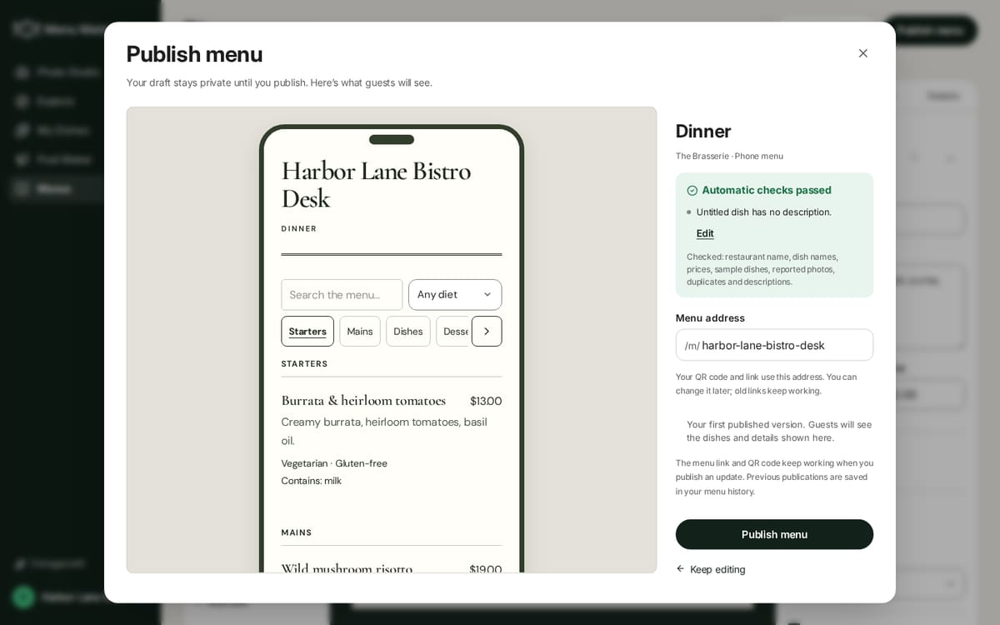
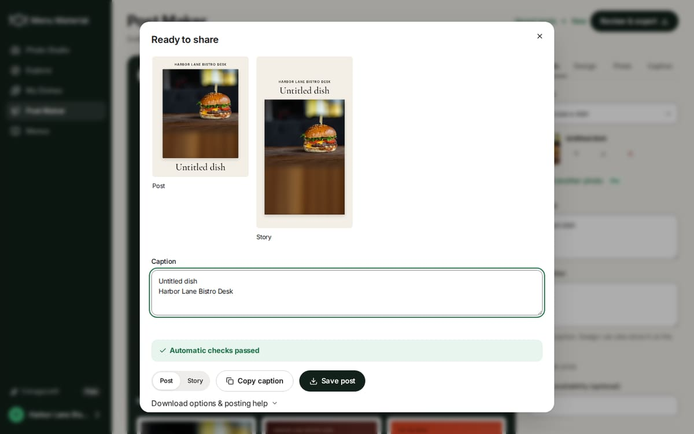
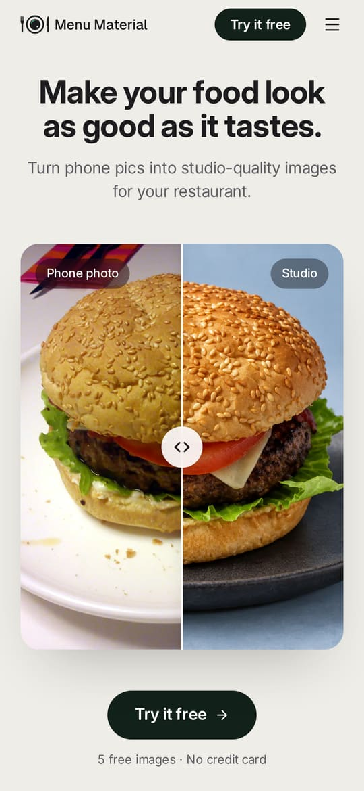
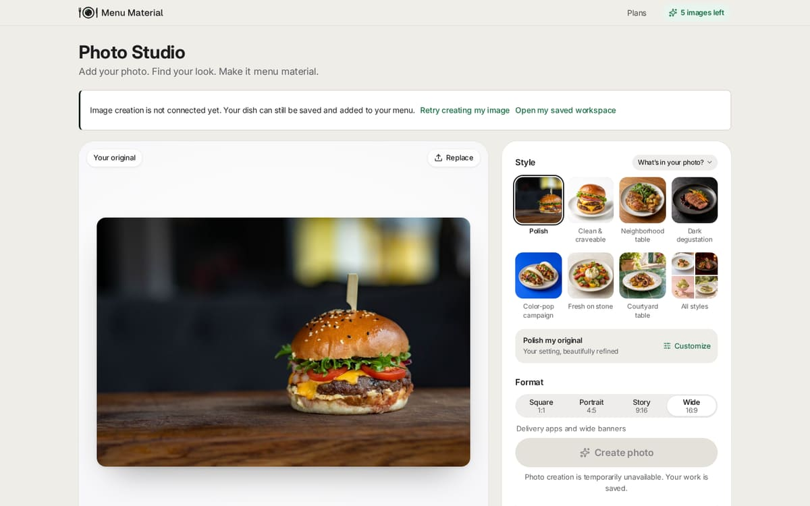
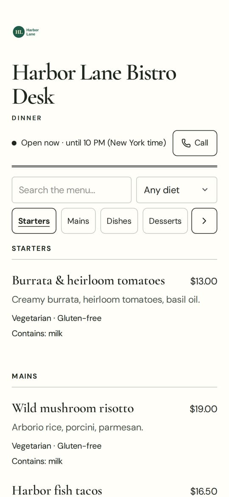
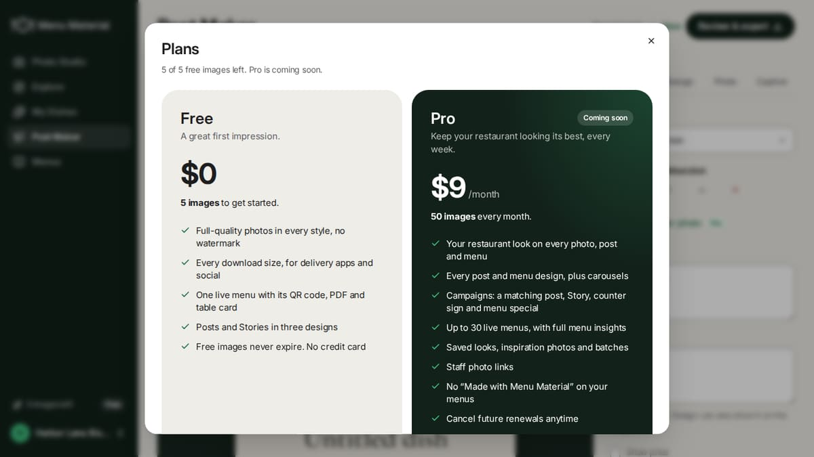

# Menu Material pre-launch review

Review date: September 26, 2026. Source: `2930393` (main after #28, "Fit the homepage's Try it free button on a phone's first screen"). This follows the [September 25 review](SITE_AUDIT_2026-09-25.md); Appendix A tracks its items.

## Fix status — September 27

Fixes landed in #30 and #31. At the owner's request, the homepage demo's AI label (L7) was left out, and #32 took back out the homepage sections, the FAQ, the first-run checklist and the line under the guest drop zone. Items marked **Yours** need the owner; they're collected under [Your follow-ups](#your-follow-ups).

| Item | Status | What changed / what's left |
|---|---|---|
| L1 Post Maker traps Free | Fixed (#30) | "+ New" makes a post Free can save; a free design brings its own colors and type; a post made on Pro opens and downloads, with "Make a Free copy" |
| L2 Allergens skip adjusted menus | Fixed (#30) | Allergens reach every linked item, and diets the dish no longer meets are removed; publishing is blocked on a mismatch, with "Match My Dishes" |
| L3 About 50 images a day | Fixed in code (#30) | Images settle at their measured cost; the $2 reservation only limits how many run at once. **Yours:** confirm the site budget and model prices |
| L4 Abandoned calls hold the budget | Fixed (#30) | Cut-off calls are settled within minutes |
| L5 "Untitled dish" goes public | Fixed (#30) | Publishing and posts stop until the dish is named, with a name field on the spot |
| L6 No Terms, refund policy, operator or contact | Built (#30); **yours** | Settings for the support email, operator, Terms and refund policy; `/contact` and `/terms`; consent at signup; disclosures by Get Pro and in Checkout; the privacy page rewritten |
| L7 Homepage demo not labeled as AI | Not changed | Left out at the owner's request |
| L8 Production settings | **Yours** | Administration → AI operations now lists the launch settings to confirm |
| B1 Pro looks Free at renewal | Fixed (#30) | Pro features stay while a renewal is charged |
| B2 Republishing on Free removes the look | Fixed (#30) | A live menu keeps its design and look |
| B3 Pro-era posts and campaigns can't download | Fixed (#30) | |
| B4 Checkout blocks deletion | Fixed (#30) | Deletion works after checkout, and administrators can delete an account |
| B5 Webhook doc; nothing reconciles | Fixed (#30); **yours** | The doc is corrected; a scheduled check records renewals, failed payments and cancellations without webhooks; a paid month no longer depends on `amount_paid`; readiness checks billing. **Yours:** the webhook address and a test-mode run |
| B6 Checkout disclosures | Fixed (#30) | |
| A1 Photo checks before signup | Fixed (#30), except Turnstile | Fixed reading for the sample, readings cached by photo, a daily cap per network. **Yours:** Turnstile keys |
| A2 IPv6 signup cap | Fixed (#31); Turnstile is **yours** | A /48 cap (default 8 a day) beside the /64 cap; a site-wide daily cap on free-image grants (default 300): later accounts open, their images wait in line and the owner is told when, with an alert naming the setting |
| A3 Free images come back | Fixed (#31) | Corrections give an image back only for the image service's or the site's failures; photos an unfinished image uses can't be deleted; a deleted account's email hash, kept a year, stops a second grant |
| A4 Sign-in lockout by email | Fixed (#31) | A browser that signed in before skips the per-account slowdown, and the message no longer states the wait |
| A5 Guest events count requests | Fixed (#31) | Each dish in a view counts against the limits, and a network brings a restaurant at most 500 guest sessions a day |
| A6 `cf-connecting-ip` | Check built (#30); **yours** | The launch settings show whether it arrives. **Yours:** check it on the hosted site |
| A7 Guest menus as a spam channel | Fixed (#30) | `nofollow ugc` links, new accounts' menus `noindex`, reserved addresses, and "Report this page" feeding Administration → Guest reports |
| S1 "Use this look again" on Free | Fixed (#30) | |
| S2 Signup when images can't be made | Fixed (#31) | The guest studio says, before a photo is added, when no image can be made (no key, paused, or the day's budget for guests and Free used up), and after signup shows that one message and saves nothing |
| S3 Signing in with 0 images | Fixed (#31) | The balance is checked before anything is saved; the photo stays and Plans is offered, or, for free images on their way, when they arrive. Out-of-images messages no longer say Free images renew |
| S4, S5 | Not changed | S5 needs the worker running (L8) |
| M1 Reported photo stays public | Fixed (#31) | A reported photo leaves live menus, specials, the public image route, link previews and its smaller copies; republishing leaves it out; Campaigns won't use it; the owner is told which menus changed. Drafts keep it for a replacement |
| M2 Photo-made dish stays at $0 | Fixed (#30) | |
| M3 Pasted layouts shift names and prices | Fixed (#30) | |
| M4 Full-size guest photos | Fixed (#30) | 480, 960 and 1440 px copies through `srcset`, cached for a week |
| §5 Low: old publish route | Fixed (#31) | The old single-menu write routes return 410 |
| P1 Plans buttons below the fold | Fixed (#31) | The buttons sit in a footer that stays in view |
| T1 Photos to OpenAI before notice | Partly (#30) | The privacy page is corrected and says a small copy goes to OpenAI. The line under the drop zone was removed at the owner's request (#32) |
| T2–T5 | Not changed | T2 would touch the homepage comparison (L7) |
| E1 No CI | Fixed (#30); **yours** | GitHub Actions runs typecheck, tests, build and the extra suites. **Yours:** require it before merging. The production-build smoke test is still to do |
| E2–E4 | Not changed | |

**Enhancements (§10)**

| Enhancement | Status | Notes |
|---|---|---|
| 1 "Get your menu live" checklist | Removed (#32) | Built in #31, then removed at the owner's request |
| 2 "Made with Menu Material" as a link | Built (#30) | Links to the site with `?ref=menu` |
| 3 Real proof and a trust FAQ | Not done | The homepage FAQ built in #31 was removed at the owner's request (#32). Partner restaurants' real results would need their photos and permission |
| 4 Menus & QR codes and Posts sections | Removed (#32) | Built in #31, then removed at the owner's request; the homepage is as it was before #31 |
| 5 Funnel measurement | Built (#31) | Administration → Launch funnel: homepage → photo → Create → signup → first export → first publish, signups by source and campaign tags, and Plans, See Pro, Get Pro and the waitlist by feature |
| 6 A better first post on Free | Not changed | |
| 7 An allergy-safe guest menu | Built (#31) | "Allergens not listed — ask us", a "No listed allergens" choice, the allergy note always shown, a "Hide allergens" filter that keeps unlisted dishes visible, and price or availability differences listed at publish with "Use My Dishes" |
| 8 A 14-day Pro trial | Not changed | |
| 9 Launch checks in readiness | Built (#30) | Administration → AI operations → Launch settings |
| 10 Cost visibility and separate pools | Partly (#30) | Images settle at measured cost, and guests and Free share 70% of the daily budget; no spend view in Administration yet |
| 11 Turnstile | **Yours** first | Needs keys; then signup, the pre-signup photo check and the funnel endpoint can use it |
| 12 A region set at signup | Not changed | |

### Your follow-ups

1. **Terms, refund policy and contact.** Write the Terms and refund policy (with a lawyer), then set `TERMS_URL`, `REFUND_POLICY_URL`, `SUPPORT_EMAIL` and `SITE_OPERATOR`. Signup, Plans, Checkout, `/contact`, `/terms` and the privacy page pick them up. Add the Terms URL in Stripe's settings if Checkout should ask for consent. Have the privacy page reviewed.
2. **Domain.** Choose the permanent domain, set `APP_ORIGIN` to it before restaurants print table cards, and redirect any old host.
3. **Stripe.** Point the webhook at `<APP_ORIGIN>/api/billing/webhook` with the events in `docs/FREE_PRO_PLANS.md`. Run checkout, a renewal, a failed payment and a cancellation in test mode, then set the live keys and `STRIPE_BILLING_ENABLED=true`.
4. **AI budget.** Confirm the site-wide daily budget (Administration), `AI_FREE_BUDGET_SHARE_PERCENT` (default 70) and the model prices (`AI_IMAGE_*_USD_PER_MILLION_TOKENS`), or set `IMAGE_COST_ESTIMATE_USD`. The launch settings show roughly how many images a day the budget allows.
5. **Worker and alerts.** Run `npm run worker` continuously; without it, held free images arrive only when their owner opens the workspace, and phones can lose an image mid-render (S5). Point an uptime monitor at `/api/health/ready`, and set `ALERT_WEBHOOK_URL` so budget, worker, billing and daily free-grant alerts reach you.
6. **Launch settings.** On the hosted site, open Administration → AI operations and clear every "Needs attention": in particular that `cf-connecting-ip` arrives (A6) and that `ADMIN_SETUP_KEY`, `PLAN_LIMITS_ENABLED=false` and `LOCAL_DEVELOPMENT` are gone.
7. **Deploy.** Sites applies the checked-in migrations; confirm 0020 and 0021 ran.
8. **Turnstile.** Get keys for signup and the pre-signup photo check.
9. **Caps.** Tune `FREE_SIGNUP_GRANTS_PER_DAY` (default 300) and `SIGNUPS_PER_WIDE_NETWORK_PER_DAY` (default 8) if launch traffic needs it.
10. **GitHub.** Require the CI checks before merging to `main` (branch protection).
11. **Backups.** Back up D1 and R2 together, and restore them once.
12. **Growth.** Tag launch links with `utm_*` so Launch funnel can attribute signups.
13. **A browser pass on Free.** Post Maker's New, "Make a Free copy", and downloading a post and a campaign made on Pro after a downgrade.
14. **L7.** The homepage demo's AI label stays open, as you chose.

## Bottom line

The site is close.

On the production build:
- the homepage shows its main image in about 0.3 s unthrottled, and in 2.8 s on slow 4G with a slowed phone CPU;
- every public page passes axe, logs no console errors and fits a 390 px phone.

All 46 test suites, the typecheck and the build pass. A fresh security review found the foundations sound: tenant isolation, sign-in, uploads, headers and the Stripe webhook. Nearly every September 25 fix held up when re-tested.

What stands between the site and a public launch is a short list:

1. **Post Maker is broken for Free accounts,** and every new signup is on Free. "New" creates a draft with Pro settings that can't be saved, exported or escaped (L1, S).
2. **Allergen changes can miss live menus.** A My Dishes allergen or diet change skips any menu where that dish's tags were adjusted, and nothing says so (L2, S–M).
3. **The AI budget can stop image creation for everyone:**
   - with the default settings, image creation stops site-wide after about 50 images a day;
   - abandoned AI calls can lock the rest of the day's budget until midnight UTC.

   (L3–L4; a setting change now, then S code fixes.)
4. **"Untitled dish" goes public** on menus and posts, with "Automatic checks passed" (L5, S).
5. **No Terms, refund policy, operator name or contact,** with open signup and a paid plan (L6, M, mostly yours).
6. **The homepage demo isn't labeled as AI** (L7, S).
7. **Production settings to confirm:** domain, worker, AI budget, Stripe webhook (L8, yours).

Items 1–4 and 6 are small code changes. With those, the legal pages and the settings, the site is ready to open. Section 2 lists what to fix before Stripe billing is switched on, or now if it already is.

## How this was checked

- **Checks.** Ran `2930393` on Node 24:
  - `typecheck`, `lint` and the build;
  - all 46 test suites: the 35 in `npm test`, plus menus, templates, exports, workspace exports, web assets and photo preview.
- **Walkthrough.** Walked the production build under wrangler, with migrations applied, in Chromium 141:
  - viewports: 1440×900, 390×844 (3×, touch), and 1366×768 for dialogs;
  - path: homepage → guest Photo Studio → signup → My Dishes → Menus → publish → the guest menu on a phone → Post Maker → Settings → Plans → account deletion;
  - the dev server was used only for dev-only checks.
- **Six parallel source reviews:**
  - plans and billing;
  - accounts, security and abuse;
  - Photo Studio and image creation;
  - menus and the guest menu;
  - Post Maker, Campaigns and the workspace;
  - the marketing site, SEO, legal pages and docs.
- **How findings were confirmed:**
  - Findings were reproduced with scripts against the real `handle()` API, `tick()`, the post renderer and the lib modules, or traced end to end in code.
  - Every §1 finding and the main §2–§3 findings were re-checked in code for this report.
- **Automated checks:**
  - axe-core on the public pages, the guest menu and the main workspace screens;
  - transferred bytes and LCP;
  - HTTP status codes and headers.
- **Not covered:**
  - the hosted site: this environment's network policy blocked it, so production settings, the worker, Stripe and the host's headers are unverified;
  - live AI output (there was no OpenAI key);
  - physical phones and screen readers;
  - legal review.

Effort is relative: **S** = a focused change, **M** = a coordinated feature, **L** = substantial work.

## 1. Fix before launch

### L1. Post Maker's "New" traps every Free account in a post it can't save — Blocker (S)

**What happens**
1. A Free owner makes a post, then clicks **+ New**. Every new signup is on Free.
2. The new draft gets the restaurant's colors and type (`brandMode: "restaurant"`). Those are Pro.
3. Saving returns 402 ("This post design is part of Pro."). The Plans sheet opens, and "This post uses Pro options" appears on an empty post.
4. Choosing a dish, or any of the three free designs, doesn't clear it: every design keeps `brandMode`.
5. Review & export, opening another draft, "Save my changes as a copy" and New all save first, so they all fail.
6. Reloading restores the same draft from the tab's recovery copy.

Post Maker is unusable in that tab until it's closed. This is a regression from #26: it passed the plan to the other two places that build a new draft, and missed this one.

**Evidence**
- `app/components/post-maker.tsx:424` calls `initial(state.restaurant, 2)`.
- `initial()` defaults to `pro = true` (`:82`) and then adds the brand fields (`:112`, `lib/restaurant-look.ts:220-227`).
- `lib/post-templates.ts:182-198`: `freePostDraft` rejects them.
- `lib/post-templates.ts:222-235`: `applyPostTemplate` keeps `brandMode` in every design.
- `lib/server/creation.ts:59-63` refuses the save.
- `app/components/creation-shared.tsx:262-283`: New, open and export save first.
- `app/components/creation-shared.tsx:133-148`: recovery on reload.
- Reproduced by two reviewers with scripts:
  - the post made on first load saves (200);
  - the New draft returns 402 `pro_required`/`postTemplates`;
  - it still does after choosing a dish, and after each free design.

**Fix**
- Pass `pro` at `:424` and remove the default, so the compiler catches the next case.
- On Free, choosing a design should reset color, accent, typography and `brandMode` to the design's own.
- A refused save shouldn't block New, opening another draft or export.
- Add an API test that a New draft on Free saves.

### L2. Allergen and diet changes in My Dishes skip menus where the dish was adjusted — Blocker, guest safety (S–M)

**What happens**
1. The Brownie is Gluten-free in My Dishes.
2. On the Dessert menu the owner also ticks Vegetarian (the item panel says "Changes apply to this menu") and publishes.
3. The recipe changes. In My Dishes the owner removes Gluten-free and adds Contains gluten.
4. The notice says only "Dish details saved."
5. The live menu still says "Vegetarian · Gluten-free", with no Contains line.
6. The dish still appears under the guest Gluten-free filter, and the menu's structured data still claims `GlutenFreeDiet`.

Adding an allergen fails the same way. Peanuts added to Pad Thai never reach a menu where its tags were adjusted.

The same gap opens in three other ways:
- "Update My Dishes" from the menu builder leaves other live menus on their old tags, and later allergen additions skip them.
- "Restore as draft" brings back an old publication's tags and price as they were.
- Linking an item that's already live copies the dish ID but not its tags.

**Evidence**
- `lib/menu-checks.ts:365-370` (`applyDishUpdate`): tags follow the dish only when the item's tags equal the dish's old tags, or the item has none.
- `lib/server/menu-documents.ts:1094-1125` (restore), `:445-471` (linking) and `:1214-1297`.
- `app/components/dish-library.tsx:990-995`: the notice lists only the menus that changed.
- Reproduced with four scripts against `handle()`.

**Fix**
- Carry safety tags one way:
  - an allergen added to a dish is added to every linked item, drafts and live;
  - a diet claim removed from a dish is removed everywhere.

  Per-menu tailoring can still add allergens or remove claims, never the reverse.
- Block publishing when a linked item lacks one of its dish's allergens, or claims a diet the dish dropped.
- In the notice, name the menus that kept their own values.

### L3. With default settings, the whole site makes about 50 images a day — Blocker, settings (S), then code (M)

**What happens**
- Each image reserves $2 against one site-wide daily AI budget. The budget is shared by guests, Free and Pro, and defaults to $100.
- A finished image is settled at `IMAGE_COST_ESTIMATE_USD`. That setting is blank in `.env.example`, so each image keeps counting the full $2.
- After about 50 images in a UTC day, every restaurant's next image waits with "Waiting for the daily AI budget to reset at 00:00 UTC". Paying customers wait too. For an owner in California, that means waiting until 5 pm.
- Ordinary launch-day traffic is enough: ten new signups using their five free images, or one Pro restaurant using its 50 in a day.

**Evidence**
- `lib/server/safeguards.ts`:
  - `:29`: the $100 default;
  - `:53-67`: the $2 reservation;
  - `:70`: one site-wide pool;
  - `:84-89`: a Pro restaurant may reserve its allowance × $2 in a day;
  - `:186-191`: images settle only when the estimate is set.
- `.env.example:6-9`.
- Reproduced two ways:
  - ten free accounts' 50 images held the next Pro image;
  - one Pro account's 50 images held a new signup's first image.
- With `IMAGE_COST_ESTIMATE_USD=0.07`, the same 50 images counted $3.50 and nothing was held.

**Fix**
- **Before launch (S):**
  - set `IMAGE_COST_ESTIMATE_USD` to the measured cost per image;
  - raise the site-wide budget in Administration → AI operations to what you're willing to spend in a day.
- **Then (M):**
  - settle images from the usage OpenAI returns, as text calls already are;
  - keep headroom in the site-wide pool for paid plans.

### L4. Abandoned AI calls hold their budget until midnight UTC — High (S)

**What happens**
- Photo checks, captions and menu readings reserve $0.10–$0.50 before calling OpenAI. They settle it when the answer arrives.
- The settlement can fail to run:
  - On Cloudflare Workers, closing the tab cancels the request, so the settlement never runs. Only image calls are kept alive.
  - A timeout marks the call "uncertain", which also keeps the full reservation.
  - Nothing releases these reservations later.
- **Anyone can use this:**
  - photo checks from 25 IPv6 networks lock $50, without an account;
  - five free accounts that start menu readings and disconnect lock $100.

  After that, all AI work waits until 00:00 UTC, including paying restaurants' images.
- **It also happens by accident.** Owners who close a tab during a long menu reading build up the same phantom spend.
- **Plausible, related:** menu reading uses the default 25-second timeout but allows 9,000 output tokens, so large menus may time out routinely. Try a real 40–60 dish menu.

**Evidence**
- `lib/server/generation.ts:584-682`: `provider()` reserves, fetches with `AbortSignal.timeout(25000)`, then settles.
- Only image dispatch is kept alive: `lib/server/generation.ts:1340-1344`. The reason is at `lib/server/monitoring.ts:89-105`.
- `lib/server/photo-analysis.ts:172-197`; `lib/server/menu-tools.ts:392-437`.
- Only image rows are reconciled later: `lib/server/generation.ts:1115-1118`.
- Reproduced with a provider call that never returns:
  - 600 reservations were still `reserved` six hours later;
  - a new visitor got 429;
  - a Pro image was held.

**Fix**
- Run text calls under the same keep-alive as images (S).
- In the worker's housekeeping, release text reservations older than about twice the timeout (S).
- Lower the text reservations toward their real cost: about $0.01 for photo checks and captions, and $0.05 for menu readings (setting).
- Give menu reading a longer timeout (S).

### L5. A new owner's first dish is "Untitled dish", and it passes the publish and post checks — High (S)

**What happens**
1. Home → Try it free → upload your own photo. The guest studio asks for no dish name.
2. Create photo → sign up. My Dishes shows "Untitled dish · No price yet".
3. Menus → Use my dishes → Select all. Only the $0 price is flagged.
4. After a price is set, the publish review says **"Automatic checks passed"**, and lists "dish names" among the things it checked.
5. My Dishes → Use photo → Make a post. The post, the Story and the caption all say "Untitled dish", again with "Automatic checks passed".
6. Renaming the dish inside the menu doesn't rename it in My Dishes, so Post Maker keeps the placeholder.

Most owners who follow the homepage's main button with their own photo will reach this, and the result is public.

**Evidence**
- `lib/guest-studio.ts:90` and `lib/studio.ts:373` create the name.
- `lib/menu-checks.ts:60-160` checks the restaurant name, sample dishes, $0 prices and duplicates, but not dish names.
- `app/components/post-maker.tsx:156-168` checks the restaurant name, the caption and the price only.
- Seen in the production build:

<table><tr>
<td width="50%"></td>
<td width="50%"></td>
</tr></table>

**Fix**
- Ask "What's this dish called?" (optional) in the guest studio and after signup.
- Block publishing and export while a dish is named "Untitled dish", with a way to rename it on the spot.

### L6. Open signup and a paid plan, with no Terms, refund policy, named operator or contact — Blocker (M, mostly yours)

This has been open since September 24. Signup is now open and Pro is built, so it matters more.

**What's missing**
- **Contact:**
  - the privacy page ends "A public support email address is not available yet" (`app/privacy/page.tsx:128-131`);
  - the footer links only Pricing, Privacy and Guidelines (`app/components/site-chrome.tsx:31-35`);
  - `/contact` and `/terms` return 404.
- **Terms and consent:**
  - there's no Terms page;
  - signup asks for no consent (`app/components/auth.tsx:269-289`);
  - Stripe Checkout is created without terms consent or tax settings (`lib/server/billing.ts:358-373`);
  - the guidelines grant no rights to generated images (`app/guidelines/page.tsx:54-65`).
- **Operator:** no page names who runs Menu Material.
- **Refunds and renewal terms:** not stated anywhere.

**Who gets stuck**
- **A Pro customer who forgets their password.** Cancelling needs a sign-in ("from Plans in your workspace", `app/pricing/page.tsx:34`). Resets come only from an administrator (`app/components/auth.tsx:292-293`). With no contact, a chargeback is their only route.
- **Anyone who ever clicked "Get Pro".** Deleting their account is refused with "Contact support to close it" (§2 B4), and there is no support.
- **A diner or rights-holder** who wants to report a guest menu.

**What's expected**
- Stripe asks businesses to show customer-service contact details, refund and cancellation policies, and terms on their website.
- US automatic-renewal rules expect the renewal terms, and how to cancel, to be shown before purchase.

**Minimum before opening signup**
1. **A support email (S)** in the footer, the privacy page, the pricing FAQ, the sign-in dialog and the error pages.
2. **A `/terms` page**, reviewed by a lawyer, covering:
   - the operator's legal name and address;
   - eligibility (businesses, 18+) and the countries you sell to;
   - acceptable use (fold in the guidelines);
   - who owns uploads and outputs, a commercial-use grant for outputs, and whether content is used for training or marketing;
   - an AI-accuracy disclaimer;
   - monthly renewal, cancellation at period end, and the refund policy;
   - suspension and takedown, with a notice address;
   - liability and governing law.
3. **Consent and disclosures (S):**
   - "By creating an account you agree to the Terms and Privacy policy" under the signup button;
   - renewal, cancellation and refund lines next to "Get Pro";
   - the Terms URL and `consent_collection[terms_of_service]` in Stripe Checkout.
4. **Privacy page additions (S):**
   - the operator, as controller, with a contact;
   - the processors: OpenAI, Cloudflare, Stripe, the host and the error webhooks;
   - retention periods;
   - privacy rights and how to use them;
   - what guest-menu visits record.
5. **Password reset (M):** self-serve reset needs an email provider. Until then, the support address is the recovery path.

### L7. The homepage demo isn't labeled as AI or as illustrative — High (S)

- **The hero comparison:**
  - it is labeled "Phone photo | Studio";
  - its slider is announced as "Compare the phone photo with the Menu Material version" (`app/components/photo-comparison.tsx:109-116`);
  - the "Studio" image was made with a different AI image tool, not with Menu Material (`docs/burger-image-provenance.json`: `"editMethod": "Built-in imagegen"`).
- **The showcase wall:** its 22 photos are text-to-image generations (`docs/STUDIO_V2_IMAGE_PROMPTS.json`), shown under "Studio quality photos for every occasion".
- **Where "AI" appears:** neither the homepage nor the pricing page says "AI" in visible text. It appears only in image alt text and in the Enlarge dialog.
  - #19 removed the footer line that said "AI edits", so README's "clearly labeled" is no longer true.
- **Why it matters:** a demo that doesn't show the product's real output is a false-advertising risk, and owners whose results differ will leave.

**Fix**
- **Now (S):**
  - a visible caption under the comparison and under the wall: "Illustrative AI edits. You review every result.";
  - rename "Studio" to "AI studio edit".
- **Better:** replace them with three or four unretouched Menu Material results from partner restaurants, with written permission (Enhancement 3).

*The phone's first screen now fits the headline, the comparison and "Try it free" (#28), but it never says the right-hand image is an AI edit.*

### L8. Production settings to confirm before launch — yours

This review couldn't reach the hosted site, so none of these could be checked. Each one changes what customers see.

| Setting | Why it matters |
|---|---|
| A permanent custom domain, with `APP_ORIGIN` set to it | Canonical links, link previews, the sitemap, Stripe return URLs and every **printed QR code** use it. Pick it before restaurants print table cards, and keep old hosts redirecting. |
| The Stripe webhook at `<APP_ORIGIN>/api/billing/webhook` | `docs/FREE_PRO_PLANS.md:42` still names `dishlight-studio.cflash7.chatgpt.site`, an old host. At the wrong URL, renewals and cancellations never arrive (§2 B5). |
| Whether billing is on | `docs/FREE_PRO_PLANS.md:7` says the hosted site has billing enabled; `README.md:104` says it's off until `STRIPE_BILLING_ENABLED=true`. If it's on, §2 is urgent. |
| `IMAGE_COST_ESTIMATE_USD` and the site-wide AI budget | See L3. |
| The background worker (`npm run worker`), running continuously | Without it, images are made by the owner's open page. On a phone that switches apps mid-image, the paid image is lost (§4 S5). |
| An uptime monitor on `/api/health/ready`, and `ALERT_WEBHOOK_URL` | So a dead worker, a stuck queue or a spent budget reaches you. |
| `cf-connecting-ip` present on requests | Without it, every visitor shares one rate-limit bucket: five signups a day for the whole site (§3 A6). Check with two visitors on different networks. |
| `ADMIN_SETUP_KEY` removed; `PLAN_LIMITS_ENABLED` not `false`; `LOCAL_DEVELOPMENT` unset | Leftover setup and test switches. |
| Backups of the D1 database and the R2 bucket, restored together once | Nothing in the repo shows a tested restore. |

## 2. Before Stripe billing is switched on (now, if it already is)

The server enforces Free limits correctly on nearly every path. The Stripe webhook's signature checks and duplicate handling are solid. These are the gaps.

### B1. Pro customers look Free at every renewal until the new invoice is paid — Medium (S)

**Cause**
- At renewal, Stripe moves the subscription's period forward and leaves the new invoice as a draft for about an hour before charging it.
- The app records a paid period only once the invoice is paid.
- Its 14-day grace covers only `past_due`, not `active`.

**What the customer sees in that window**
- guest menus show "Made with Menu Material";
- the restaurant look and Pro designs lock;
- images fall back to leftover free ones, often 0;
- Plans offers "Get Pro", and checkout answers "You already have a subscription";
- a republish strips the brand look (B2).

The window is longer if webhooks lag, and comes every month if the webhook URL is wrong (B5).

**Evidence**
- `lib/server/entitlements.ts:13-18`, `:56-63`.
- `lib/server/billing.ts:169-180`, `:195-213`.
- Reproduced with a Stripe fixture: period rolled forward, invoice still a draft. The one-hour draft window is Stripe's documented behavior; confirm it with a test clock.

**Fix**
- Treat `active` like `past_due` in the grace check.
- Show "Renewing…" for images during the window.

### B2. After a downgrade, Menus asks owners to republish, and republishing removes their look — Medium (S)

**What happens**
- On Free, `/api/state` returns the neutral look, so Menus compares every live menu against it.
- Every menu published with brand colors therefore shows "Republish to apply your restaurant settings". Its publish review says the name, logo, colors or currency changed, though nothing did.
- Republishing to fix a typo replaces the brand colors. In a test, the accent went from #8a1c1c to #202820.
- A live menu in a Pro design can't be republished at all without switching to The Brasserie, even to correct an allergen.

This contradicts "A downgrade keeps everything… live menus keep the look they were published with". The same prompt appears during B1's window and when an admin comp ends.

**Evidence**
- `lib/menu-checks.ts:237-256`.
- `lib/server/api.ts:936-940`.
- `app/components/menu-studio.tsx:604-613`, `:645-649`, `:747-766`.
- `lib/server/menu-documents.ts:193`, `:1025-1026`.
- Reproduced by script.

**Fix**
- Compare live menus against the saved look, not the Free look.
- On Free, allow republishing a live menu in the design and colors it's already published with.

### B3. After a downgrade, posts and campaigns made on Pro can't be downloaded as promised — Medium (S–M)

**Posts**
- Posts made on Pro carry `brandMode: "restaurant"`.
- On Free the color controls are hidden, so the note's advice ("choose a free design") still ends in a 402.
- If any dish detail changed, export waits on a save that is refused.
- Evidence: `app/components/post-maker.tsx:463-468`, `:938-941`, `:317-326`, `:349-350`.

**Campaigns**
- Any click changes the draft's activity timer, so the draft counts as changed.
- Its 10-second autosave, and the saves that run before Download and Copy caption, are refused on Free.
- Downloads then silently do nothing.
- Evidence: `app/components/promotion-workspace.tsx:361-392`, `:594-598`, `:1440`, `:1474`; `lib/server/promotions.ts:278-281`.

**Fix**
- On Free, don't autosave a post or campaign that uses Pro options.
- Let export go ahead.
- Offer "Make a Free copy".

### B4. Starting checkout once blocks self-serve account deletion — Medium (S–M)

**What happens**
- "Get Pro" creates the Stripe customer before any payment (`lib/server/billing.ts:311-323`).
- Account deletion refuses any account with a Stripe customer (`lib/server/core.ts:291-300`): "This account has billing records. Contact support to close it."
- So an abandoned checkout blocks deletion forever.
- There's no support contact, and no administrator deletion either, although the privacy page says such accounts "are removed by an administrator".
- Reproduced by script (409).

**Fix**
- Allow deletion when no subscription is active, past due or unpaid. Keep invoice rows for accounting, detached from the restaurant.
- Otherwise, cancel through Stripe first.
- Add an admin delete.

### B5. The webhook doc points at an old host, and nothing reconciles without webhooks — Medium (S)

**What's wrong**
- `docs/FREE_PRO_PLANS.md:42` names `https://dishlight-studio.cflash7.chatgpt.site/api/billing/webhook`. The rename commit had corrected it, and `89dab56` put it back.
- Without webhooks, only the checkout return page and "Refresh payment status" reconcile. Renewals, cancellations and failed payments are missed.
- `billingEnabled()` falls back to "coming soon" without saying why if any of these is missing: the flag, the three Stripe settings or `APP_ORIGIN` (`lib/server/billing.ts:19-27`). The readiness check covers none of this.
- **Plausible:** a paid period needs `amount_paid >= 900` (`lib/server/billing.ts:172`). An invoice paid partly with customer credit or a coupon reports less, so that customer gets nothing. Confirm in test mode.

**Fix**
- Point the webhook at `<APP_ORIGIN>/api/billing/webhook`.
- Run a scheduled reconcile for periods about to end.
- Add billing checks to the readiness report.
- Check `status === "paid"` and the invoice total, rather than `amount_paid`.

### B6. Checkout disclosures

See L6:
- renewal, cancellation and refund terms next to "Get Pro";
- Terms consent in Stripe Checkout;
- a support contact for customers who can't sign in.

## 3. Abuse and cost controls

### A1. Pre-signup photo suggestions can be switched off for everyone — Medium (S)

**What happens**
- All visitors share 500 photo checks a day, with 20 an hour per network.
- IPv6 networks cost nothing, so 25 of them can use up the day.
- Every "Try a sample" also uses one.

**Evidence:** `lib/server/photo-analysis.ts:171-199`; `lib/server/safeguards.ts:71-81`; `app/components/guest-studio.tsx:324-352`.

**Fix**
- Ship a fixed reading for the sample photo.
- Cache readings by image hash.
- Add a per-network daily cap and Turnstile on this check.

### A2. The signup cap doesn't limit IPv6 — Medium (S)

**What happens**
- The cap is 5 signups a day per /64.
- Homes often get a /56, and free tunnel brokers hand out a /48.
- 40 of 48 signups from one /48 succeeded.

**Evidence:** `lib/server/safeguards.ts:225-260`.

**Fix**
- Add a second cap per /48.
- Add a site-wide daily cap on new free-image grants.
- Add Turnstile once you have keys.

### A3. Free images still come back — Medium (S)

**What happens**
- **Deleting the original:** delete the original photo while a free correction is queued. The correction fails, and a credit is restored. This works 3 times per 30 days, and repeats.
- **Deleting the account:** deleting it and signing up again with the same email grants 5 new images.

**Evidence:** `lib/server/correction-policy.ts:59-66`; `lib/server/api.ts:1594-1620`, `:1662-1685`; `lib/server/core.ts:284-374`.

**Fix**
- Restore a credit only for provider or system errors.
- Refuse to delete a photo that a queued job uses.
- Remember which emails already had the free grant.

### A4. Someone who knows an owner's email can stop them signing in on a new device — Medium (M)

**What happens**
- The per-email slowdown gives each sign-in slot to whoever asks first, and says when the next one opens.
- Signup confirms which emails exist.
- In a test the owner signed in 0 of 80 times over 2 hours, against 88 attacker requests.

**Evidence:** `lib/server/safeguards.ts:280-328`; `lib/server/api.ts:281-285`.

**Fix**
- Let a correct password through from a device that signed in before.
- Replace the wait with Turnstile.
- Stop stating the wait time.

### A5. Guest-event limits count requests, not rows — Medium (S)

**What happens**
- A dish-view request carries up to 50 dish IDs, each time with a fresh session ID.
- One network can write 60,000 rows an hour (about 29 MB), which are kept for 90 days.
- It can also fake a restaurant's stats.

**Evidence:** `lib/server/menu-tools.ts:805`, `:842-874`; `lib/server/safeguards.ts:449-453`.

**Fix**
- Charge each ID against the limit.
- Cap sessions per network, per restaurant, per day.
- Aggregate views per session.

### A6. Plausible: without `cf-connecting-ip`, every visitor shares one bucket — Medium (S)

**What happens:** if the header is missing, all visitors count as one network. The whole site then gets 5 signups a day.

**Evidence:** `lib/server/safeguards.ts:251-254`.

**Fix**
- Confirm the header arrives on the host.
- Show "client network detected" in the readiness report.

### A7. Guest menus are an easy spam channel on your domain — Medium (S)

**Why:**
- They're indexable.
- Their order and reservation links are followed: they carry only `rel="noreferrer"`.
- No verified account is needed.
- Any address can be claimed: `/m/support`, `/m/menu-material`, or a brand's name.
- Guests can't report a page.

**Evidence:** `app/robots.ts:11-12`; `app/components/menu-view.tsx:325`; `app/components/menu-document-view.tsx:905`; `lib/restaurant-identity.ts:42-48`.

**Fix**
- Add `rel="nofollow ugc noopener"` to those links.
- `noindex` menus from new or unverified accounts.
- Reserve addresses such as `support` and `menu-material`.
- Add a "Report this menu" link that feeds the existing takedown.

## 4. Photo Studio and the guest handoff

**Re-tested and still working:**
- stuck jobs get settled;
- rate limits and outages (429, 503) back off, and moderation refusals are explained;
- each image is kept alive separately;
- storage is checked before any paid call;
- the guest sample stays a sample;
- illustrations stay out of delivery exports;
- GIF and AVIF are refused before anything is created;
- screen readers hear when a photo is ready.

### S1. On Free, "Use this look again" leads to a Pro wall — Medium (S)

**What happens**
- It quietly adds the chosen photo as an inspiration photo (`app/components/photo-studio.tsx:349-356`, `:879-906`).
- Inspiration photos are Pro (`lib/server/generation.ts:435-440`).
- So the next Create is refused with "Saved looks and inspiration photos are part of Pro."
- Reproduced: the first Create returned 202, the next 402.

**Fix:** on Free, keep the style and drop the reference.

### S2. Guests are sent through signup even when images can't be made — Medium (S)

**What happens**
- The guest studio always reports image creation as available (`app/components/guest-studio.tsx:476`).
- So a visitor signs up, then sees three messages that disagree:
  - "Image creation is not connected yet";
  - "Photo creation is temporarily unavailable";
  - "Your photo is saved… when you create it".
- A spent daily budget would lead to the same (L3).

**Fix:** tell guests before signup whether image creation is available.

### S3. Signing in with 0 images from the guest studio uploads first, then fails — Low (S)

**What happens**
- It creates an "Untitled dish $0.00" with the photo and a draft.
- It then fails with 402 "…see when your allowance renews", but free images never renew.
- It offers a Retry that can't work.

**Evidence:** `app/components/guest-studio.tsx:249-258`; `lib/guest-studio.ts:86-192`.

**Fix:** check the balance first and offer Plans.

### S4. A pre-signup draft takes over Photo Studio until Resume — Low (S)

**What happens**
- After a failed handoff, every load of `/#studio` opens the guest studio, with no workspace navigation.
- Start new only hides the card.

**Evidence:** `app/components/home-client.tsx:138-151`; `app/components/guest-studio.tsx:454-456`.

**Fix**
- Make Start new delete the draft.
- Show a Resume / Discard banner inside the workspace instead.

### S5. Plausible: without the worker, a phone that switches apps mid-image loses a paid image — Medium (settings + S)

**What happens**
- Without the worker, the open page makes the 30–150 s image call.
- A suspended page gets about 30 seconds of grace.
- Meanwhile the waiting screen says the page "can stay in a background tab".

**Evidence:** `app/components/studio-onboarding.tsx:253-257`; `README.md:47`.

**Fix**
- Run the worker (L8).
- On touch devices, say "Keep this screen open".

### Low

- **"Open in Menus" does nothing for guests.** When a guest's photo is read as a menu, the button does nothing and Create is disabled (`app/components/guest-studio.tsx:527`).
- **Moderation refusals contradict their button.** The message says to change the photo or the wording, but the main button resends the identical request (`app/components/photo-studio.tsx:907-933`, `:1253-1279`).
- **Pickers hide WebP.** The Photo Studio and inspiration pickers leave it out, although WebP uploads work. Use `photoAccept` (`app/components/studio-workbench.tsx:1508`, `app/components/photo-inspiration-sheet.tsx:322`).
- **Pro marking in Customize:**
  - "Match a photo you love" and "Save as a restaurant look" have no Pro badge;
  - for a guest, the Pro message renders behind the open dialog;
  - evidence: `app/components/studio-customize-sheet.tsx:346-365`; `app/components/studio-workbench.tsx:304-310`.
- **Create bar overlap.** At 1440×900, the workspace studio's sticky Create bar covers the Details box.

## 5. Menus and the guest menu

**Re-tested and still working:**
- typed notes stay notes;
- Photo Studio never renames a dish;
- "Update My Dishes" leaves live menus alone;
- allergens read "Contains: …";
- vegan dishes meet the Vegetarian filter;
- dish views are sent once per page load, and the owner's own visits are skipped;
- guest events are pruned after 90 days;
- the one-live-menu limit holds across two tabs.

### M1. A photo reported as inaccurate stays public — Medium (S)

**What happens**
- Reporting only flags the photo.
- It stays:
  - on live menus;
  - on live specials, and Campaigns even picks it for new offers;
  - on the public asset route;
  - as the share image.
- Post Maker already blocks reported photos.

**Evidence**
- `lib/server/photo-corrections.ts:111-114`; `lib/server/api.ts:761-768`; `lib/menu-structured-data.ts:35-43`.
- Campaigns: `app/components/promotion-workspace.tsx:484-490`, `:896-905`; `lib/server/promotions.ts:164-168`, `:199-204`.

**Fix**
- On report, take the photo off live copies and specials, as deleting it does.
- Tell the owner which menus changed.

### M2. A dish first made in Photo Studio stays at $0 when a pasted menu links to it — Medium (S)

**What happens**
- Price changes made later in My Dishes never reach the menu.
- The notice says only "Dish details saved."

**Evidence:** `lib/studio.ts:365-382`; `lib/menu-checks.ts:284-318`, `:354-359`.

**Fix:** when linking to a $0 dish, take the menu's price, and its description if the dish has none.

### M3. Pasting a common menu layout shifts names and prices, all marked certain — Medium (S)

**What happens**
- "Roast Chicken / potato purée, charred leeks, jus 26 / Hanger Steak / …" gives:
  - "Roast Chicken" with no price;
  - "potato purée, charred leeks, jus" at $26, with the description "Hanger Steak";
  - and so on down the menu.
- Without the commas, each dish name becomes a section.
- "Confirm the N the reader was sure of" then confirms them all, and linking creates My Dishes entries from them.

**Evidence:** `lib/menu-paste.ts:258-321`.

**Fix**
- Attach a priced line that starts in lowercase or contains commas to the unpriced dish line above it, and flag it.
- Never mark lowercase names as certain.

### M4. Guest menu photos are full size — Medium (M)

**What happens**
- Photos are stored at up to 2048 px, at quality 0.9–0.95.
- They're served as stored:
  - cached for only `max-age=300`, with no ETag;
  - no `srcset`, `width` or `height`.
- The result on mobile data is several MB per visit, downloaded again after five minutes, plus layout shift.

**Evidence:** `lib/server/api.ts:652-681`; `app/components/menu-photo.tsx:27-45`.

**Fix**
- Make 480, 960 and 1440 px copies at publish.
- Add `srcset` and `sizes`.
- Cache for a year as immutable. Photos are keyed by asset ID, and deleted ones already return 404.

### Low

- **Contradictory tags publish silently.** "Gluten-free" plus "Contains gluten", or "Vegan" plus "Contains milk", both publish, and the filters and structured data make the claim (`lib/dietary.ts:123-131`; `lib/menu-structured-data.ts:113-121`). Warn at publish, and drop the contradicted claim.
- **Interface text is marked as the menu's language.** Non-English guest menus mark their English interface text, including the allergy note, as that language (`app/components/menu-document-view.tsx:586`). Screen readers mispronounce it, and it fails WCAG 3.1.2.
- **Free can show a photo on every dish.** The "Featured dishes" layout has no cap, though the plan copy calls this Pro (`lib/plans.ts:31-45`).
- **Free menus switch themselves to a Pro design.** An untouched Free menu switches when café, brunch, bar, drinks or food-truck sections are added (`app/components/menu-studio.tsx:333-335`).
- **The old publish route still works.** A hand-made call to the old single-menu route gives Free two live menus (`lib/server/api.ts:1839-1878`). Return 410.
- **Prices follow the menu's language, not the restaurant's region.** A US restaurant's Spanish menu shows "12,50 US$" (`lib/menu-document.ts:220-234`).
- **A menu's own QR code dead-ends when it goes offline.** It shows a 404 with no way to the main menu (`app/m/[slug]/page.tsx:59`, `:97`).
- **`?menu=` pages describe the main menu.** Their canonical link, title and share image all point at it (`app/m/[slug]/page.tsx:13-49`).
- **A lone special leaves an empty page.** One published before any menu leaves an empty 200 page when it ends (`lib/server/promotions.ts:285-292`, `:408-419`).
- **Two designs load a large font file.** Guest menus in the Special and Cocktail designs load a 716 KB TTF; the same face exists as a 144 KB WOFF2 (`app/menu-studio.css:1-5`).

*The guest menu on a phone: hours, Call, search, a diet filter and "Contains:" labels, with no axe violations.*

## 6. Post Maker, Campaigns, Plans and the workspace

**Re-tested and still working:**
- words the owner hasn't touched follow the dishes;
- switching designs keeps the owner's text;
- carousels open on a cover;
- the price seal no longer blocks export;
- Story text stays clear of Instagram's bars;
- logos keep their transparency and shape;
- Campaigns uses Post Sans and never prints $0.00.

510 renders across every design and format found nothing blocked for long prices, non-Latin headlines, long names or wide logos.

### P1. The Plans dialog hides its buttons on a 1366×768 laptop — Medium (S)

**What happens**
- The dialog body scrolls, with no hint that it does.
- "Continue free" and "Tell me when Pro opens" sit below the fold. Once billing is on, so will "Get Pro".

**Evidence:** `app/components/plan-dialog.tsx:197`.

**Fix:** a sticky row of buttons.

### Low

- **Photo packs skip the Pro check in My Dishes.** My Dishes → Use photo → Photo pack has neither the Pro check nor the badge Photo Studio has (`app/components/dish-library.tsx:215-224`).
- **A typed headline outlives its dish.** A headline and price the owner typed for one dish stay after that dish is removed. The caption is flagged; the image isn't. Ask "Written for The house burger — keep it?"
- **Free users are promised a Pro feature.** Post Maker and the download sheet offer "your restaurant's look" (`app/components/post-maker.tsx:479`; `app/components/photo-downloads.tsx:462`).
- **Plausible: phone errors are hidden.** On phones, Post Maker errors render behind the Edit panel, which covers 82% of the screen (`app/workspace-patterns.css:1249-1256`; `app/components/post-maker.tsx:435`).
- **The Nightcap can cover the dish.** On unedited phone photos its headline sits over the dish, because dish detection covers the whole frame.
- **Pro previews are uneven.** Pro menu designs can be tried in a draft, but Pro post templates open Plans at once, with no preview.
- **Pricing leaves out photo packs.** The pricing card and FAQ don't list photo packs and ZIPs as Pro, while the Free card says "Every download size" (`app/components/plan-cards.tsx:86-95`; `app/pricing/page.tsx:29`).
- **Insights promise more than Pro shows.** "Menu insights" promises "the dishes guests look at"; Pro shows one "Most seen dish" (`lib/plans.ts:104`; `app/components/menu-stats.tsx:152-156`).
- **Signed-in owners see signed-out links.** On `/pricing` and `/privacy` they still see "Log in / Try it free".

## 7. Trust, privacy, SEO and performance

### T1. Visitors' photos go to OpenAI before any notice — Medium (S)

**What happens**
- Every pre-signup upload, the sample included, is sent at once for a style reading.
- #27 removed the only note under the photo, and the guest studio has no privacy link (`app/components/guest-studio.tsx:324-352`, `:385-400`).
- The privacy page says photos move to the account when you "sign in and generate". Signing in alone moves them.

**Fix**
- Add one line under the drop zone: "A small copy goes to OpenAI to suggest styles; nothing is saved until you create an account · Privacy".
- Correct the privacy sentence.

### T2. Credits for the CC BY-SA photos are a click away, and missing where the photos travel — Medium (S)

**Where credit is missing or hidden**
- **Homepage:** only a bare "Photo credits" link at the bottom (`app/components/menu-material-landing.tsx:21-23`).
- **Share image:** every page's `og:image` is the burger and its edit, with no credit (`app/site-metadata.ts:13-19`).
- **Sample:** "Try a sample" uses the same photo, with no credit (`lib/studio.ts:222-228`).

**Fix**
- Add captions under the comparison and the gallery.
- Add a credit to the share image and to the sample.

### T3. Guarantee wording remains — Low (S)

The studio still makes promises:
- "Your food always stays the same.", a screen-reader hint (`app/components/studio-workbench.tsx:1477-1478`);
- "Ingredients, portions and meaningful branding stay the same." (`app/components/studio-customize-sheet.tsx:274-275`).

Word them as intent.

### T4. Stale docs and data — Low (S)

- `docs/FREE_PRO_PLANS.md:3` says pre-signup photos are "held in memory". They're kept in IndexedDB for 24 hours, renewed on each change.
- README contradicts itself on billing (`:5` vs `:104`), and still says "pilot" and "private hosted review".
- The homepage's structured data offers only the free allowance; its comment says Pro is not for sale yet (`app/site-metadata.ts:52-84`).
- The privacy page says "When subscriptions are available".

### T5. Performance — M in total

- **One stylesheet for every route.** It's 388,757 bytes (67 KB gzip) and loads everywhere, guest menus included. Split the marketing, workspace and guest-menu CSS (M).
- **Guest-menu fonts.** Guest menus load 292 KB of fonts before any photo. Subsetting the fonts and giving guest menus their own stylesheet would take a menu without photos from about 580 KB to about 250 KB (S–M).
- **Static files aren't cached.** `/homepage`, `/fonts`, `/studio` and `/favicon.ico` are served with `max-age=0` and without the security headers. Only `/_next/static` has a cache policy (`dist/client/_headers`). Give versioned assets long cache headers (S).
- **Unused files in `public/` (S).** About 13 MB of unreferenced files ship there, for example:
  - `burger-studio-transformation.png` (2.4 MB);
  - `homepage/styles/cheesecake-original.jpg` (2.1 MB);
  - 6 MB of lossless masters;
  - 2.5 MB of TTFs used only by tests.

  `public/burger.jpg` has no recorded source or license. Move sources and fixtures out.

### Low

- **Slider label.** The comparison slider has no `aria-valuetext`.
- **axe flags three things:**
  - contrast in the Menus empty-state illustration;
  - a nested `complementary` landmark in the menu editor;
  - heading order in "Describe your dish" and More tools.
- **Invalid staff links return 200.** `/s/<invalid token>` should return 404.
- **404 pages carry two robots tags.**

## 8. Engineering

### E1. Nothing checks a change before it reaches `main` — High (S)

**Why it matters**
- There is no CI, and `CLAUDE.md` tells every session to merge its own pull request.
- The site runs on a beta framework (vinext `1.0.0-beta.5`), which has already broken in production only: links did nothing, per the September 25 review.

**Fix**
- Add a GitHub Actions workflow that runs `typecheck`, `npm test` and `build` on every pull request, and require it before merging.
- Then add a smoke test of the production build: start it, load `/`, sign up, publish a menu, open it.

### E2. Lint

- 57 errors and 98 warnings (was 58 errors):
  - 33 are `no-explicit-any`;
  - 23 are React hook rules: 14 `set-state-in-effect` and 9 refs read during render.
- Fix the hook errors, then run lint in CI on changed files.

### E3. Account security

- Sessions renew forever, with no absolute limit.
- Owners can't change their password or sign out other devices; only an administrator's reset clears sessions (`lib/server/core.ts:206-239`).
- Add an account security page (M).

### E4. Repo hygiene

- `.gitignore` doesn't cover `.dev.vars` (Wrangler's local secrets file) or stray `*.sqlite` files.
- More than 20 files in `docs/` contain local paths that include your user name.
- `npm audit --omit=dev` reports one moderate issue, in the build-time package `baseline-browser-mapping`. `npm audit fix` clears it.

## 9. What's working — keep it

- **The phone's first screen:** the headline, the before/after and "Try it free" fit at widths from 375 to 430 px (#28).
- **Speed:**
  - the homepage is 929 KB on desktop and 1.25 MB on a 3× phone before scrolling;
  - LCP is 2.8 s on slow 4G with a 4× slower CPU, and about 0.3 s unthrottled;
  - Explore dropped from about 11 MB to 3.6 MB on a 3× phone.
- **Accessibility:**
  - 0 axe violations on every public page, the 404s, the guest studio, the guest menu, My Dishes and Post Maker;
  - the same in the publish, share, plans, settings and delete dialogs, apart from the exceptions in §7;
  - no horizontal scrolling at 390 px;
  - the style gallery works with arrow keys.
- **Honest plan prompts:** "Try it in your draft. Publishing this design is part of Pro"; "Free includes one live menu…"; the waitlist answers "You're on the list."
- **Menus:** the publish review shows what guests will see and stops $0 prices. Share gives a QR code per placement and confirms guest access.
- **The guest menu on a phone:** "Contains:" labels, an allergy note, search, a diet filter, "Open now · until 10 PM", Call and Directions, and structured data, with no layout shift.
- **Security:**
  - tenant isolation: 20 cross-restaurant probes were all refused;
  - the dev sign-in can't be reached in production, and only `cf-connecting-ip` is trusted;
  - uploads are checked by content, with SVG and HTML refused;
  - links are `http(s)` only, structured data is escaped, and there are no open redirects or server-side fetches of user URLs;
  - scrypt with a version marker, and sessions are revoked on reset;
  - security headers on every page, with guest menus left embeddable.
- **Stripe:**
  - timing-safe signature checks and idempotent periods;
  - Stripe's current state is re-read on every event;
  - https-only return URLs;
  - Free limits are enforced on the server, inside the write.

## 10. Enhancements

Ranked by expected effect on launch and early growth.

1. **A first-run "Get your menu live" checklist (S–M).** Name and price your first dish, publish your menu, print your table card. Today a new owner lands in Photo Studio with nothing pointing to Menus, though Free's live QR menu is its most lasting value.
2. **Make "Made with Menu Material" a link, with `?ref=menu` (S).** It appears on Free guest menus (`app/components/menu-document-view.tsx:955`, `app/components/menu-view.tsx:550`). Every table scan becomes a referral, and diners get a route to the privacy page.
3. **Real proof on the homepage (M):**
   - replace the Commons demos with three or four unretouched Menu Material results from partner restaurants, with permission;
   - add a short trust strip and FAQ: it's AI-edited, your original is kept, you approve every photo, who owns the images, whether photos train AI, how to cancel.

   This fixes L7 and T2 for good.
4. **Sell the whole product (S–M).** No visible homepage text mentions QR menus, the menu builder or Instagram posts, though Free includes a live menu. Add "Menus & QR codes" and "Posts" sections with real screenshots; they also target "QR menu" searches.
5. **Measure the funnel before spending on launch channels (M):**
   - record homepage → upload → Create → signup → first export → first publish;
   - record the referrer and UTM tags at signup;
   - show upgrade prompts by feature;
   - store which feature a waitlist signup came from (`lib/server/api.ts:1289`).
6. **A better first post on Free (S):**
   - for 8 of 10 common dishes, the recommended design is Pro, so Free opens on the photo-only "Just the dish", where "Show price" changes nothing (`app/components/post-maker.tsx:212-215`; `lib/post-composition.ts:112-114`). Open on From the pass or The daily special instead;
   - show Pro designs with the owner's own dish in the Plans sheet;
   - send Free owners' weekly suggestions to Post Maker rather than the Pro-only Campaigns.
7. **An allergy-safe guest menu (M):**
   - "Allergens not listed — ask us" for dishes nobody has checked;
   - the allergy note always shown;
   - an "exclude peanuts" filter;
   - in the publish review, list linked dishes whose price, availability or tags differ from My Dishes, with "Use My Dishes" for each. That also prevents L2 and M2.
8. **A 14-day Pro trial (S)** through the existing comp date (`restaurants.pro_until`), so owners see their own look on menus and posts before the paywall. Fix B2 first.
9. **Launch checks in the readiness report (S).** Cover `APP_ORIGIN`, the image cost estimate and site budget, the worker heartbeat, whether `cf-connecting-ip` was seen, recent webhooks and the billing settings. Most of L8 could then be checked from Administration.
10. **Cost visibility and separate pools (M):**
    - settle images at measured cost;
    - show reserved and settled spend in Administration, with "Release stuck reservations";
    - keep separate daily pools for guests, Free and paid plans.
11. **Turnstile (S, once you have keys)** on signup and the pre-signup photo check, the two anonymous paths that spend money.
12. **A region set once at signup (M),** like the timezone, for price formats and translated guest-menu labels.

## 11. Suggested order

1. **Before launch (this week):**
   - L1, L2, L5, L7 and the L3–L4 code fixes (all S);
   - L6: a support address, Terms, consent and the privacy additions;
   - L8: the settings and the worker;
   - E1: CI on pull requests.
2. **Before switching billing on:**
   - B1–B5 and the Stripe disclosures;
   - a test-mode run of checkout, renewal, a failed payment and cancellation.
3. **First two weeks after launch:**
   - the §3 abuse controls, A1–A3 and A7 first;
   - S1–S2, M1–M4, P1, T1 and T2.
4. **Then:** the enhancements, starting with 1, 2, 5 and 7.

## Appendix A — status of September 25 items

| Item | Status | Notes |
|---|---|---|
| H1 Notes become diet tags | Fixed | Re-tested |
| H2 Photo Studio renames dishes | Fixed | Re-tested |
| H3 "Update dish library" publishes drafts | Fixed | Re-tested |
| H4 Posts keep the first dish's facts | Fixed | A typed headline still outlives its dish (§6) |
| H5 Allergens don't reach linked items | Partly fixed | The import case works; adjusted and restored items still miss changes (L2) |
| H6 Allergen labels, vegan filter | Fixed | |
| B1 Recovery, verification, support | Partly fixed | Sessions renew and a 401 reopens sign-in; no reset email or support address (L6) |
| B2 Terms, consent, deletion, privacy | Partly fixed | Deletion works, except after checkout (B4); no Terms or consent; privacy gaps (L6, T1) |
| B3 AI budget drain | Partly fixed | Text calls settle and Free text is capped, but images don't settle by default (L3) and abandoned calls never do (L4) |
| B6 Paying | Built | Free/Pro and Stripe are built; billing's state in production is unknown (L8); see §2 |
| §4 Site-wide sign-in lockout | Fixed | A targeted per-email lockout remains (A4) |
| §4 Error reports to Slack | Fixed | |
| §4 Free images regenerate | Partly fixed | New routes: deleting the original, or the account (A3) |
| §4 A full workspace still pays for images | Fixed | Storage is checked before each paid call |
| §5 Stuck jobs, 429/503, one image failing others | Fixed | |
| §6 Guest sample, illustration exports, WebP/GIF | Fixed | The pickers still hide WebP (§4) |
| §7 Visit stats and pruning | Fixed | Event rows can be inflated (A5) |
| §7 Reported photos attached automatically | Fixed | Ones already published stay (M1) |
| §7 Guest menu photos | Partly fixed | Cacheable for 5 minutes, not resized (M4) |
| §8 Post Maker and Campaigns | Fixed | Campaigns still use reported photos (M1) |
| §9 Settings errors hidden | Fixed | |
| §9 SEO basics | Fixed | robots.txt, sitemap, canonical links, favicon and per-page titles |
| §9 Stylesheet split | Open | 388,757 bytes on every route (T5) |
| §9 Unused files in `public/` | Open | About 13 MB (T5) |
| §11 Dev server upload limit | Fixed | A 3.3 MB upload returned 201 in dev |
| §11 `test:photo-preview` on Linux | Fixed | Passes |
| §11 Lint | Open | 57 errors (was 58), and lint blocks nothing (E1, E2) |
| Left for you: payments, email, Terms and support, CAPTCHA | Open | L6, L8, §2 |
| Product decisions: fold Campaigns into Post Maker; Style vs Brand; locale | Open | |

## Appendix B — measurements

All on the production build under wrangler. Bytes are transferred bytes.

| Check | September 25 | Today |
|---|---|---|
| `npm run typecheck` | Pass | Pass |
| `npm run lint` | 58 errors (after fixes) | 57 errors, 98 warnings |
| Test suites | 45 pass | 46 pass (35 in `npm test`, plus 11 more) |
| `npm run build` | Pass | Pass |
| Homepage, desktop 1×, before / after scrolling | 942 KB | 929 KB / 962 KB |
| Homepage, phone 3×, before / after scrolling | 1,256 KB | 1,245 KB / 1,300 KB |
| LCP, unthrottled (median of 5) | ~270 ms | 308 ms desktop, 252 ms phone |
| LCP, phone on slow 4G with 4× CPU slowdown | — | Homepage 2.8 s, guest menu 1.5 s, pricing 1.6 s |
| CSS | 380 KB (66 KB gzip), every route | 388,757 B (67 KB gzip), every route including guest menus |
| JavaScript | ~216 KB homepage | 202 KB homepage; 168–174 KB info pages; 213 KB guest menu; +73 KB when the guest studio opens |
| Guest menu without photos | — | 582 KB, including 292 KB of fonts; layout shift 0.003 |
| Explore, fully scrolled | ~11 MB on high-density screens | 3.6 MB on a 3× phone, 1.55 MB on desktop |
| axe | 0 on public pages | 0 on public pages, 404s, guest studio, guest menu and main workspace screens; exceptions in §7 |
| Horizontal overflow at 390 px | — | None on any page visited |
| HTTP | robots, sitemap and favicon were 404 | robots, sitemap, favicon and the four info pages 200; `/terms`, `/contact` and unknown URLs 404; missing menu 404 with `noindex`; `/s/<invalid>` 200; `/pilot` 308 → `/pricing` |
| Security headers | none | HSTS, `nosniff`, Referrer-Policy, Permissions-Policy, `frame-ancestors 'none'` and `X-Frame-Options: DENY`; guest menus embeddable; static files uncovered |
| Link-preview metadata | In `<head>` for preview bots | Unchanged; guest menus get a share image only once they have a logo or photo |
| `npm audit --omit=dev` | — | 1 moderate, in a build-time package |

## Appendix C — how the key bugs were reproduced

- **L1:**
  1. Sign up (Free).
  2. In Post Maker, make a post.
  3. Click + New.
  4. `POST /api/creation-drafts` returns 402 `postTemplates`.
  5. Choose a dish, then each free design: still 402.
- **L2:**
  1. Give a dish Gluten-free in My Dishes.
  2. On a menu, also tick Vegetarian, then publish.
  3. In My Dishes, remove Gluten-free and add Contains gluten.
  4. `GET /api/public/<slug>` still lists Vegetarian and Gluten-free and no allergen.
- **L3:**
  1. With default settings, have ten free accounts each make five images (or one Pro account make 50).
  2. The next image anywhere on the site stays queued with the daily-budget hold.
  3. Set `IMAGE_COST_ESTIMATE_USD=0.07` and the same run completes.
- **L4:**
  1. Stub the provider so it never answers.
  2. Start 500 guest photo checks and 100 menu readings.
  3. The `ai_spend` rows stay `reserved` for the rest of the UTC day.
  4. A new guest gets 429 and a Pro image is held.
- **L5:** Home → Try it free → upload a photo → Create photo → sign up → Menus → Use my dishes → set a price → Publish: "Automatic checks passed" with "Untitled dish".
- **B1:**
  1. Stripe fixture: an active subscription whose period has rolled forward, with the new invoice still a draft.
  2. The plan reads Free, the guest menu shows the credit, and republishing returns 402.
  3. After `invoice.paid`: Pro, with 50 images.
- **B2:**
  1. Comp a restaurant, set a brand color and publish.
  2. End the comp.
  3. Menus shows "Republish to apply your restaurant settings".
  4. Republishing changes the live color to #202820.
